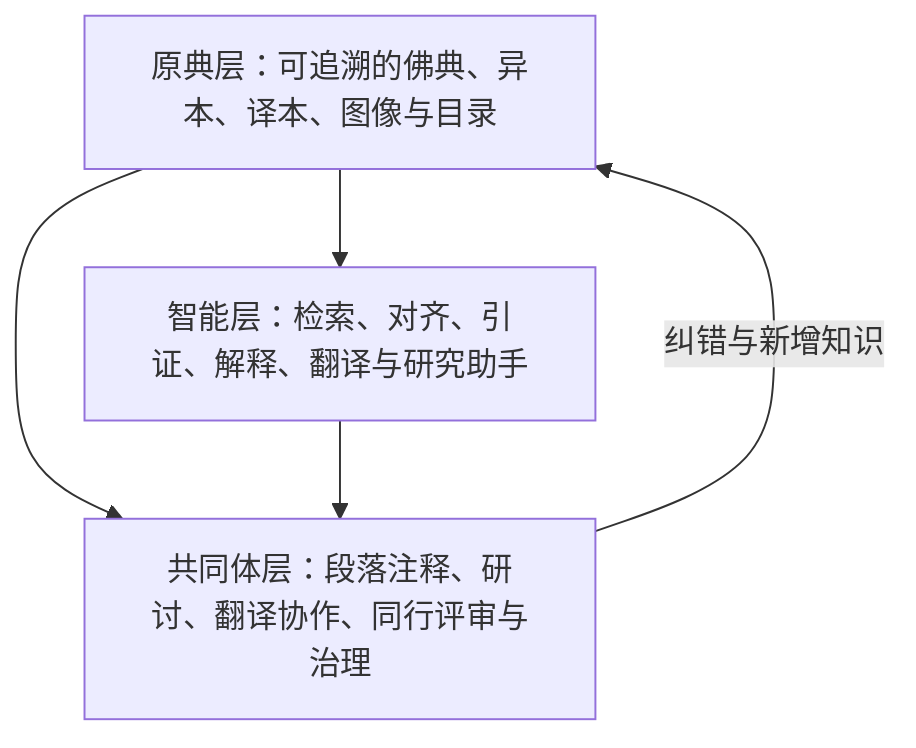
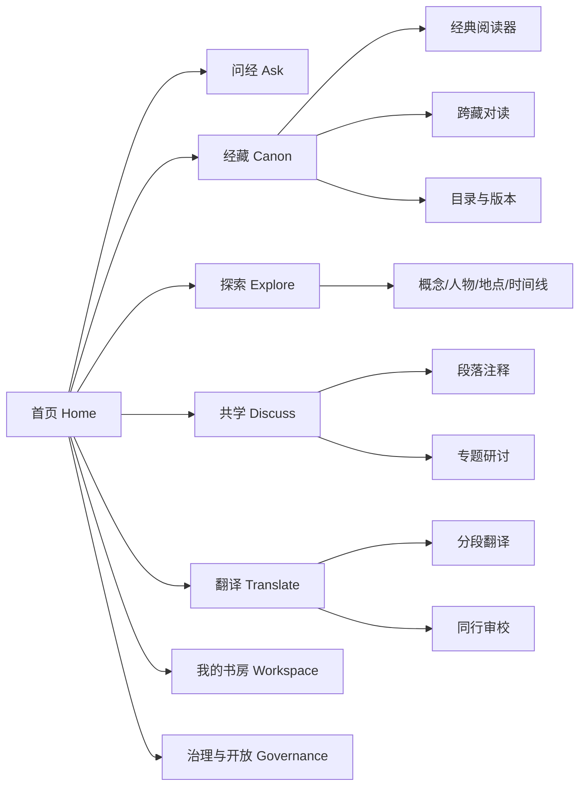
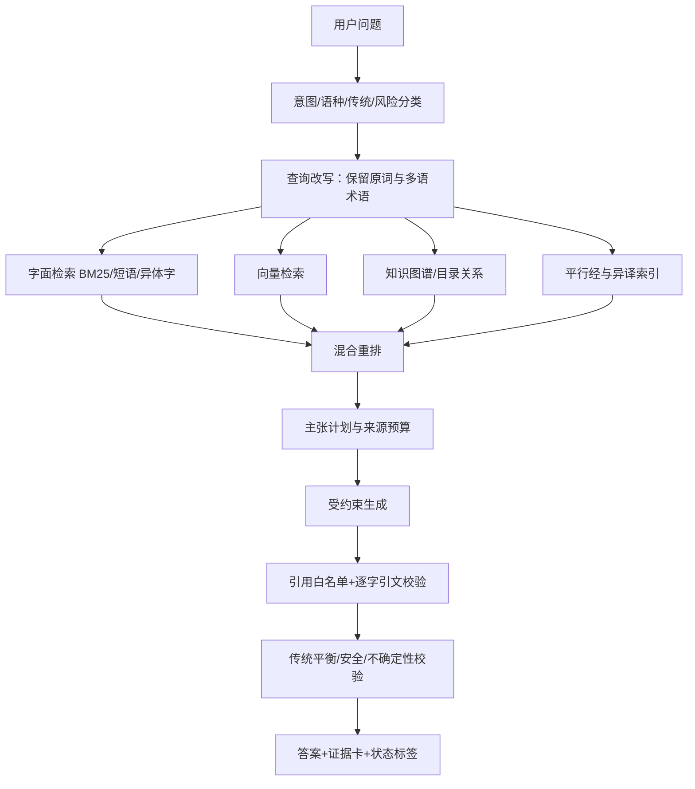
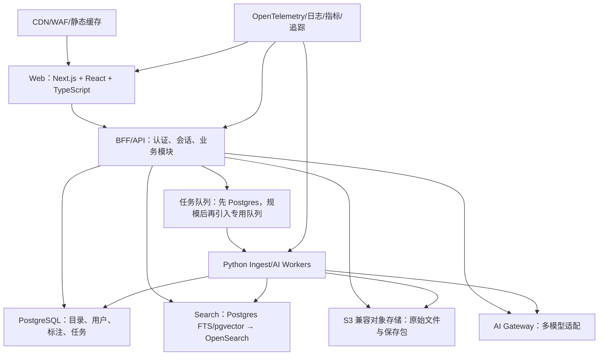
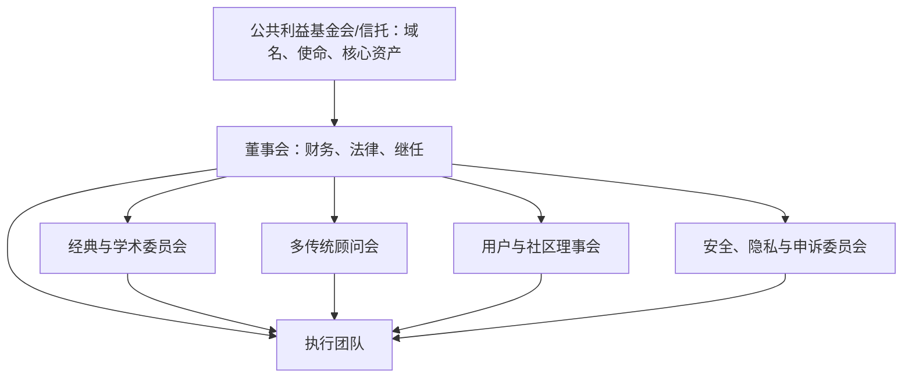

# foxue.ai 全球佛学交流 AI 平台建站方案

> 版本：v1.0  
> 日期：2026-08-11  
> 文档性质：产品战略、佛典工程、AI 架构、UI/UX、治理与百年保存总方案  
> 篇幅说明：按 21 个逻辑页组织；Markdown 导出为 A4/PDF 后预计显著超过 10 页  
> 研究范围：X、GitHub、skills.sh、佛典数字化机构、Web/档案标准与 AI 风险规范  

---

## 目录

1. 执行摘要与最终建议
2. 第一性原理：重新定义“完美”
3. 使命、定位与不可逾越的边界
4. X 与 GitHub 的 UI/UX 研究结论
5. 用户、任务与价值主张
6. 产品结构与核心用户旅程
7. UI 视觉系统与全球可访问性
8. 关键页面与交互规格
9. “收录 99% 佛经”的可审计定义
10. 佛典来源、版权与数据工程
11. 引证优先的佛学 AI 架构
12. 可替换、可迁移的技术架构
13. 运行 100 年的保存与传承机制
14. 安全、隐私、宗教伦理与合规
15. 全球社区、翻译协作与内容治理
16. 推荐 Skills、安装优先级与审计
17. 产品路线图：30 天到 100 年
18. 团队、组织、预算与长期资金
19. KPI、SLO、评测与发布门槛
20. 主要风险、反目标与止损线
21. 未来 30 天执行清单
22. 附录：关键数据结构、决策记录与来源

---

## 第 1 页｜执行摘要与最终建议

### 1.1 一句话定位

**foxue.ai 是一个开放、可引证、跨语种、跨传统的全球佛学知识与协作基础设施：让任何人都能从问题出发，抵达可核验的原典、异译、注疏与真实的人类交流。**

它不是“AI 佛陀”，不是宗派宣传站，也不是给 ChatGPT 换一套莲花皮肤。它应当同时成为：

- 普通人的可信佛学入口；
- 修学者的经典阅读与个人研习空间；
- 僧团、学者、译者的协作平台；
- 开发者可以调用的开放佛典知识基础设施；
- 即使原团队消失，仍能被图书馆、寺院、大学和开源社区接管的数字文化遗产。

### 1.2 三个最重要的战略判断

| 原始目标 | 第一性问题 | 建议定义 |
|---|---|---|
| 普度众生 | 网站不能替代修行、僧团、善知识或个人选择 | 降低众生接触可信佛法的语言、知识、地域和身体障碍 |
| 完美运行 100 年 | 没有技术栈、公司或创始人天然能活 100 年 | 建立可替换技术、开放数据、分布式保存、长期基金和继任治理 |
| 收录 99% 佛经 | 世界上不存在一个无争议的“佛经总数” | 建立版本化全球总目录，分别审计“编目、原文、译文、授权、校勘”覆盖率 |

### 1.3 产品的三层核心



### 1.4 立即做出的 12 项决策

1. 以“引证优先”而非“聊天优先”为产品原则。
2. 首页同时提供搜索、任务入口、经典发现和社区活动，不使用孤零零的空白输入框。
3. 所有 AI 回答把“原典引文、传统解释、现代研究、AI 综合”视觉分层。
4. AI 不扮演佛陀、菩萨或历史高僧；只允许用户选择“传统视角”，并显示范围与局限。
5. 先建立“全球佛典注册表”，再谈 99% 覆盖。
6. 原始文件永不覆盖；标准化文本、OCR、译文和 AI 对齐都作为派生层保存。
7. 每条文本、每次修改、每项授权都具备稳定 ID、版本和来源记录。
8. MVP 从“模块化单体 + 独立数据工人”开始，不从微服务开始。
9. 前端可用 Next.js/React 快速交付，但核心语料可导出为 TEI XML、JSONL、纯文本和静态站。
10. 基础经典、检索与引证式问答永久免费；不售卖广告，不出售或训练用户的宗教/精神隐私数据。
11. 域名、商标、核心语料目录和使命章程最终归非营利基金会或公共利益信托持有。
12. 每年发布可离线运行的“foxue.ai 年度典藏版”，并交由至少四个独立机构保存。

### 1.5 总体推荐

**推荐采用“先可信、后智能；先目录、后规模；先阅读、后社交；先开放标准、后平台特性”的路线。**

最有价值的首个版本不是功能最多的版本，而是能把一个问题可靠地带到原典段落，并让用户清楚看到“这是谁的文本、哪个版本、如何翻译、AI 做了什么、哪里不确定”的版本。

---

## 第 2 页｜第一性原理：重新定义“完美”

### 2.1 从不可再分的事实开始

1. 佛法的价值不来自界面，而来自教法、实践、理解、慈悲与智慧。
2. AI 是概率系统，会生成似是而非的内容和虚假引文。NIST 的生成式 AI 风险资料明确将“编造的逻辑或引文”列为重要风险，因此不能把模型流畅度当作真实性。[NIST AI RMF 与生成式 AI Profile](https://www.nist.gov/itl/ai-risk-management-framework)
3. 佛教不是单一文本、单一语言或单一解释传统；差异本身就是必须保存的知识。
4. 文本的数字副本不等于文本被永久保存；保存还需要校验、复制、迁移、治理与资金。
5. 任何具体框架、模型、数据库和云厂商都会被替换。
6. 任何组织都可能解散，任何创始人都会离开。
7. “完美”若意味着永不出错，就是不可实现目标；若意味着能发现错误、诚实呈现错误、快速纠正并保留历史，则可以工程化。

### 2.2 foxue.ai 的“完美公式”

> **完美 = 真实可追溯 × 失败可见 × 持续可纠正 × 人人可抵达 × 跨代可接管**

任何一项为零，整体就失去意义：

- 内容丰富但不可追溯，会成为高质量幻觉制造器；
- AI 准确但无法被残障人士、低带宽用户或小语种用户使用，不是普惠；
- 产品好用但数据被公司锁死，不能活过公司；
- 数据开放但没有治理、资金与继任机制，不能活过创始人；
- 社区活跃但用争议和成瘾机制增长，会背离使命。

### 2.3 六条不随技术变化的系统公理

| 编号 | 公理 | 产品含义 |
|---|---|---|
| P1 | 原典高于生成 | AI 只能解释和导航，不能替代来源 |
| P2 | 差异高于伪统一 | 异译、异本、宗派观点并排呈现，不强行合并 |
| P3 | 来源高于权威口吻 | 不因模型语气自信而提升可信度 |
| P4 | 可退出高于平台锁定 | 用户、语料、标注、讨论均可导出 |
| P5 | 公共利益高于注意力 | 不以停留时长、无限滚动和争议热度为核心 KPI |
| P6 | 继任能力高于创始人控制 | 章程、资产、密钥、文档和责任均可移交 |

### 2.4 “普度众生”的产品化表达

不把宏大愿景写成不可验证的口号，而把它拆成可验证结果：

- 一个不懂古汉语的人，能在 3 分钟内读懂关键术语并看到原文；
- 一个研究者，能精确引用版本、卷、页、段与永久链接；
- 一个盲人用户，能用屏幕阅读器完成搜索、阅读和提问；
- 一个低带宽地区的用户，能打开轻量版或离线包；
- 一个泰语、藏语、僧伽罗语或缅甸语用户，不必先学英语才能使用核心功能；
- 一个对某宗派说法存疑的人，能查看其他传统和文本证据；
- 一个译者，能看到原文、异译、词典、版本差异和审校历史；
- 一个 2126 年的维护者，不需要 2026 年团队的私有云账号就能恢复系统。

---

## 第 3 页｜使命、定位与不可逾越的边界

### 3.1 使命陈述

**让世界上每个人都能自由、平等、可验证地接触佛教经典，并在尊重差异的共同体中学习、翻译、讨论与保存这些智慧。**

### 3.2 对外品牌承诺

- **可验证**：重要陈述都能回到具体文本与版本。
- **多传统**：不暗中把某一宗派包装成“唯一佛教”。
- **不冒充**：AI 永远明确标识，不冒充佛陀、高僧、学者或用户。
- **不成瘾**：不使用无限滚动、情绪热榜、赌场式通知和攀比型功德积分。
- **不出售隐私**：宗教、精神、情绪与修学问题不进入广告画像。
- **可携带**：文本、笔记和引用能导出，核心数据可由其他机构恢复。

### 3.3 明确不做什么

1. 不宣称 AI 开悟、有证量或能授戒、灌顶、认证修行成就。
2. 不替代僧侣、教师、医生、心理咨询师、律师或紧急服务。
3. 不生成“佛陀对当代事件的确定看法”之类的伪权威结论。
4. 不通过模拟已故高僧口吻制造“本人正在回答”的错觉。
5. 不在没有授权时镜像现代译著或把“网上可读”误当成“可再发布”。
6. 不把生成式翻译标成“权威译本”。
7. 不把用户热度、点赞量或模型相似度当成经典真伪依据。
8. 不以 Web3、区块链或“去中心化”口号替代真正的保存责任；哈希有用，但不能代替机构、资金和多副本。

### 3.4 品牌命名建议

- 中文主名：**佛学 AI / foxue.ai**。
- 英文副标题：**Buddhist Canon & Global Learning Commons**。
- AI 助手避免神格化，可命名为“经藏助手 / Canon Guide”，不要命名为“AI Buddha”。
- 对外解释“佛学”既包括信仰与修学，也包括历史、语言、哲学、文献学和数字人文；平台不判定用户必须以哪种身份进入。

---

## 第 4 页｜X 与 GitHub 的 UI/UX 研究结论

### 4.1 X 上的关键信号

本次研究把 X 当作产品设计讨论现场，而不是权威标准来源；有价值之处在于发现正在出现的交互问题和方向。

| 信号 | 观察 | 对 foxue.ai 的决策 |
|---|---|---|
| “输入框不是全部 UI” | Hardik Pandya 指出，把所有专用界面替换为文本框，会把发现能力和表达意图的负担推给用户，系统也会变得不可导航。[原帖](https://x.com/hvpandya/status/2040706500453404910) | 首页保留搜索框，但同时提供阅读、对照、术语、研究、讨论等明确入口 |
| 生成式 UI | A2UI 的发布强调 Agent 可以生成交互式界面，而不只返回文本。[原帖](https://x.com/osanseviero/status/2002747011230269893) | AI 回答可生成经文对照卡、概念图、时间线和阅读计划，但组件必须来自受控白名单 |
| 异步任务与人工确认 | LangChain agent-inbox 的案例突出异步处理、中断、请求确认和恢复执行。[原帖](https://x.com/tuturetom/status/1880067349182828952) | OCR、长篇研究、翻译和批量对齐进入任务中心，关键发布动作需人工批准 |
| 原型工具不等于生产系统 | 对 v0 的体验反馈认为其展示了未来方向，但未必能直接进入严肃生产工作流。[原帖](https://x.com/i/status/1887191345477132542) | v0/生成工具只用于探索，最终代码必须进入设计系统、测试、评审与可访问性门槛 |
| 模型与前端分离 | 关于模型厂商和 AI 前端相互竞争的讨论，反映出“模型质量”和“产品界面”是可分离能力。[原帖](https://x.com/levelsio/status/1953527259022668126) | 建立模型网关，不把 foxue.ai 的命运绑定到单一模型厂商 |

### 4.2 GitHub 上值得学习的 AI UI/UX 项目

星标为 2026-08-11 研究快照，只表示社区关注度，不等于适合直接采用。

| 项目 | 快照与强项 | 可学习 | 不应照搬 |
|---|---|---|---|
| [Open WebUI](https://github.com/open-webui/open-webui) | 约 140k stars；离线、自托管、权限、PWA、多模型、语音 | 完整设置、权限、离线和模型兼容性清单 | 面向通用个人 AI，信息架构过重，不适合作为佛典首页 |
| [Chatbot UI](https://github.com/mckaywrigley/chatbot-ui) | 约 33.3k stars；多模型、聊天历史、Supabase | 基础会话、移动布局、用户设置 | 仍是聊天中心，不能承载经典版本学和跨藏对读 |
| [Vercel Chatbot](https://github.com/vercel/chatbot) | 约 20.8k stars；Next.js、AI SDK、Artifacts、可访问组件、持久化 | 流式输出、工具调用、生成式 UI 和快速 MVP | 默认云组件形成厂商耦合；需容器化与数据层替代方案 |
| [assistant-ui](https://github.com/assistant-ui/assistant-ui) | 约 11.5k stars；可组合消息、输入、线程、工具 UI、人工批准、可访问性 | 适合作为 AI 交互原语层，逐像素自定义 | 不应让组件库决定品牌和信息架构 |
| [LobeHub](https://github.com/lobehub/lobehub) | 多模型、知识库、PWA、插件；2.0 从“Chat”转向“Hub”和服务端异步任务 | 从聊天工具升级为知识与任务中心的方向 | 功能规模大，若直接 fork 会继承过多通用 Agent 复杂度 |
| [OpenUI](https://github.com/thesysdev/openui) | 约 6.5k stars；流式结构化 UI 与 Agent Skill | 受控组件白名单、渐进式结果展示 | 标准仍在快速演进，只做实验层，不作为核心数据格式 |
| [A2UI](https://github.com/a2ui-project/a2ui) | Agent-to-User Interface 开放格式，处于预览/演进期 | 为未来生成式界面保留适配接口 | 不把预览协议写进百年核心数据层 |

### 4.3 佛学领域的直接参考

| 项目 | 关键启示 | 结论 |
|---|---|---|
| [SuttaCentral Bilara](https://github.com/suttacentral/bilara) | 翻译界面克制；每个段落有稳定 JSON ID；原文、译文、注释、异读可共用同一段 ID | foxue.ai 的翻译工作台应学习其“文本流优先”和不可变段 ID |
| [FoJin 佛津](https://github.com/xr843/fojin) | Apache-2.0 代码；仓库自述聚合 10,500+ 文本、613 个来源、跨汉巴藏检索、引文白名单与逐字引文校验；第三方数据各自保留授权 | 这是最接近 foxue.ai 的开源基线。Phase 0 必须做 fork/合作/重建三选一的技术与法律尽调 |
| [OpenPecha / WeBuddhist](https://github.com/OpenPecha) | AI、藏文工具、图像转写、翻译、经文检索与社区方向 | 优先寻求互操作和合作，不重复造藏文 OCR、分词与 Pecha 工具 |
| [CBETA XML P5](https://github.com/cbeta-org/xml-p5) | 正式 TEI P5 XML 经文和丰富藏经结构 | 汉文底层应保留 TEI 和 CBETA 原始标识，不把网页 HTML 当母版 |

### 4.4 综合 UI/UX 原则

1. **不是 Chat-first，而是 Evidence-first。**
2. **不是一个无限对话，而是可返回、可收藏、可引用的知识对象。**
3. **不是模型吐出任意 HTML，而是模型选择受控的经文卡、对照表、术语卡和时间线。**
4. **不是让用户猜提示词，而是让任务和能力可见。**
5. **不是即时完成一切，而是对长任务提供进度、暂停、审批和恢复。**
6. **不是复制通用 AI 的紫色渐变，而是从纸张、墨色、校勘、经函、边注和多语文字本身建立视觉识别。**

---

## 第 5 页｜用户、任务与价值主张

### 5.1 六类核心用户

| 用户 | 主要任务 JTBD | 当前痛点 | foxue.ai 价值 |
|---|---|---|---|
| 初学者 | “我想理解一个概念，但不知道从哪里开始” | 术语门槛、宗派混杂、AI 幻觉 | 通俗解释 + 原典证据 + 下一步阅读 |
| 修学者 | “我想围绕一个主题持续研读并做笔记” | 资料分散、无法跨端、缺少上下文 | 个人经藏、段落笔记、阅读路径、隐私模式 |
| 僧侣/教师 | “我想准备一堂课并核对出处” | 引文查找慢、异译难对照 | 精确检索、引文导出、版本对照、讲义工作区 |
| 学者 | “我需要版本、语种、异读和永久引用” | 数据库割裂、标识不统一 | 跨库目录、稳定 ID、API、TEI/JSONL 导出 |
| 译者/志愿者 | “我想翻译并接受同行审校” | 工具割裂、版本失控、术语不一致 | 分段工作台、翻译记忆、术语库、评审与发布流程 |
| 开发者/机构 | “我想在自己的应用里引用可靠佛典” | 缺少统一 API、授权不清 | 只读 API/MCP、授权标签、来源与版本可追溯 |

### 5.2 北极星任务

**在最短时间内，帮助用户完成一次“可验证的理解”：看到答案，打开证据，理解差异，并知道下一步去哪里。**

北极星指标不使用“日活时长”，建议使用：

> **每周完成的可验证学习会话数（Verified Learning Sessions, VLS）**

一个会话只有同时满足以下条件才计入：

- 用户提出问题或选择学习任务；
- 系统返回至少一条有效原典来源；
- 用户打开至少一个来源或对照视图；
- 用户完成收藏、笔记、引用、继续阅读或反馈中的至少一项；
- 回答未触发引用错误或重大安全问题。

### 5.3 价值主张层级

1. **立即价值**：比传统数据库更容易找到经文，比通用 AI 更可信。
2. **复利价值**：笔记、对照、术语和阅读路径逐渐形成个人知识图谱。
3. **共同体价值**：纠错、翻译和注释成为可审计的公共贡献。
4. **文明价值**：经典和软件被长期保存，并能被下一代重新部署。

---

## 第 6 页｜产品结构与核心用户旅程

### 6.1 顶层信息架构



### 6.2 主导航建议

- 桌面端：`问经｜经藏｜探索｜共学｜翻译｜书房`，全局搜索固定可见。
- 移动端：`首页｜搜索｜问经｜书房` 四个底部入口；其余放入“更多”。
- “治理与开放”“数据来源”“版权”“API”“状态页”放在页脚和账户菜单，但不可隐藏。

### 6.3 七条关键旅程

#### 旅程 A：从问题到原典

1. 用户问：“色即是空是什么意思？”
2. 系统先识别文本/概念/传统范围，不急于长篇回答。
3. 返回 100 字直接解释和 2–4 个证据卡。
4. 用户展开《心经》汉译、藏译或梵本相关段落。
5. 系统标注哪些是原文、译文、注疏、现代解释和 AI 综合。
6. 用户可进入“般若—中观—唯识如何解释”的对照路径。

#### 旅程 B：从经典到提问

1. 用户打开某卷某段。
2. 选中文字后出现“解释术语、查看异译、问这段、添加笔记、引用”。
3. AI 上下文锁定到所选段落及其相邻段，不暗中换经。
4. 引用自动带永久 URI、版本、行/段与访问日期。

#### 旅程 C：跨藏对读

1. 以一个文本或主题为锚点。
2. 展示权威目录对应关系与机器候选对应关系，二者视觉区分。
3. 并排显示汉、巴利、藏、梵及现代译文。
4. 用户逐段接受、拒绝或评论机器对齐。

#### 旅程 D：研究任务

1. 用户发起复杂问题。
2. 系统先显示研究计划、来源范围和预计耗时。
3. 异步检索并实时展示已查来源，而不是伪造“思考过程”。
4. 最终输出主张—证据矩阵和可导出报告。

#### 旅程 E：翻译与审校

1. 译者领取或创建文本项目。
2. 原文段、异读、已有译文、术语建议并排。
3. AI 建议默认不进入正式译文，必须由人类接受。
4. 译者提交后进入双人审校、领域审校、版权审查和发布。

#### 旅程 F：全球共学

1. 所有讨论锚定到文本段、概念或公开课程。
2. 跨语言帖子可机器翻译，但原文始终可见。
3. 贡献声誉来自引证、纠错、翻译和同行认可，不来自情绪化点赞。

#### 旅程 G：离线与低带宽

1. 用户选择语种、传统和典籍包。
2. 下载静态阅读包/PWA 数据包。
3. 离线笔记保存在本地；联网后由用户主动同步。

---

## 第 7 页｜UI 视觉系统与全球可访问性

### 7.1 设计方向：“无相编辑部”

视觉不是仿寺庙，也不是赛博莲花，而是一间安静、严谨、面向世界的数字经藏编辑室：

- 纸张与墨色提供温度；
- 朱砂用于校勘、引证和关键动作；
- 边注、行号、函号、段号表达文本结构；
- 多语文字本身成为视觉主体；
- 大面积留白服务专注；
- 动效表现“展开证据、对齐文本、恢复上下文”，不表现神秘光效。

### 7.2 初始色彩令牌

| Token | 亮色建议 | 暗色建议 | 用途 |
|---|---|---|---|
| `surface-canvas` | `#f4f0e6` 宣纸白 | `#101612` 夜墨 | 全局背景 |
| `surface-raised` | `#fffdf7` | `#19211b` | 卡片与阅读纸面 |
| `text-primary` | `#1e2620` | `#eef1e7` | 主文字 |
| `text-muted` | `#667067` | `#a9b2a8` | 元数据 |
| `accent-cinnabar` | `#a33a2b` | `#d66a59` | 主动作与校勘标记 |
| `accent-moss` | `#5c6b53` | `#91a486` | 已核验、来源 |
| `accent-gold` | `#9d7b3f` | `#c6a969` | 稀少强调，不作大面积渐变 |
| `border-subtle` | `#d8d1c2` | `#344038` | 结构分隔 |

正式发布前必须用实际字体、字号和状态做 WCAG 对比度测试，不能只凭色值直觉。

### 7.3 字体系统

- 简繁中文：思源宋体/Source Han Serif 用于经文，思源黑体/Source Han Sans 用于界面。
- 拉丁、巴利转写：EB Garamond 或具备完整附加符号支持的开源衬线体。
- 藏文：Noto Serif Tibetan。
- 天城文：Noto Serif Devanagari。
- 僧伽罗、缅甸、泰文、日文、韩文分别选择经母语用户验证的 Noto/本地开源字体。
- 不追求“一种字体覆盖所有语言”；按 `lang` 与 `script` 切换字体并测试组合音标、断行和行高。

Unicode 按“文字系统”而非“语言”编码，且同一语言可能包含多个文字系统，因此数据和界面必须同时保存 BCP 47 语言标签与 script 信息。[Unicode Supported Scripts](https://www.unicode.org/standard/supported.html)

### 7.4 阅读排版

- 正文默认宽度 64–76 个拉丁字符；汉字正文约 28–38 字/行。
- 经文、译文、注释各有固定层级，不用颜色作为唯一差异。
- 允许用户设置字号、行距、栏数、脚注位置、原译文顺序与竖排实验模式。
- 卷、品、章、段、页、栏、行等原始定位信息可显示或隐藏，但永不丢失。
- 多栏对读支持“同步滚动”和“独立滚动”切换，避免强制错位。

### 7.5 动效与声音

- 标准过渡 160–240ms；长任务进度使用真实状态，不用无意义旋转动画。
- 支持 `prefers-reduced-motion`，关闭视差、漂浮和连续背景动画。
- 音频默认不自动播放；诵读必须显示版本、朗读者/合成语音与语速。
- AI 合成语音明确标识，绝不冒充真实法师录音。

### 7.6 可访问性底线

W3C 建议使用 WCAG 2.2 以提高未来适用性。[WCAG 2.2](https://www.w3.org/TR/WCAG22/)

发布底线：

- WCAG 2.2 AA；关键阅读、搜索、问经、登录和导出流程争取 AAA 的相关条款；
- 全键盘可用，焦点顺序稳定，焦点样式清晰；
- 屏幕阅读器能读出“原典/译文/AI 综合/用户评论”等语义；
- 所有图、时间线、知识图谱都有文本等价物；
- 不用拖拽作为唯一操作；
- 触控目标至少 44×44 CSS px；
- 错误信息指明原因、位置和修复方式；
- RTL 与复杂文字脚本进入自动化视觉回归；
- 2G/高延迟模式提供无图、无动画、无实时 AI 的经典阅读核心。

---

## 第 8 页｜关键页面与交互规格

### 8.1 首页

首页的单一工作不是“让用户输入 Prompt”，而是“让用户看见自己可以怎样接近佛法”。

首屏结构：

1. 品牌使命：`从问题，回到原典。`
2. 统一搜索/提问框，旁边明确切换：`找经文｜问含义｜查术语｜做研究`。
3. 4 个真实任务示例，按用户语言与历史选择变化，但不开暗黑个性化。
4. “今日一段”必须带经名、版本和打开原文入口，不显示无出处鸡汤。
5. 继续阅读、最近书房；未登录时存本地并提示隐私。
6. 正在进行的公开翻译/校勘项目和全球线上研讨。

### 8.2 问经页

桌面建议三栏：

| 左栏 | 中栏 | 右栏 |
|---|---|---|
| 对话与研究历史 | 回答正文、主张卡、工具结果 | 证据抽屉、版本、原文、许可、相关段 |

移动端将右栏变成底部“证据”标签；任何一条关键主张旁都能直接打开对应证据，不能只在答案末尾堆引用。

回答状态必须至少包括：

- `有充分来源`；
- `来源存在分歧`；
- `仅找到间接资料`；
- `未找到可靠来源`；
- `引用已自动纠正`；
- `需要人工专家复核`。

### 8.3 经典阅读器

核心功能：

- 可复制的稳定段落链接；
- 原始页/栏/行定位；
- 版本、底本、来源、授权和修改历史；
- 简繁转换只作显示层，不改变母版；
- 搜索命中上下文；
- 选择文本后解释、对照、笔记、讨论和引用；
- AI 面板默认收起，避免遮蔽阅读；
- 无 JavaScript 时仍能阅读核心正文。

### 8.4 跨藏对读页

三种对应关系必须分开：

1. `目录确认`：来自权威目录或学术出版；
2. `人工确认`：由认证编辑/学者审定；
3. `机器候选`：由算法提出，尚未确认。

机器相似度只能帮助发现，不能把“相似”标成“同一教说”。

### 8.5 术语与实体页

一个术语页包含：

- 多语词形、转写、语源；
- 不同传统的定义；
- 典型原典用例；
- 译者选择与历史变化；
- 相关概念但不强行等同；
- 人物、地点、时代、文本关系；
- 可导出引用。

### 8.6 共学页

- 讨论入口从具体经文段落或专题进入；
- 默认按“有引证/同行认可/最新”切换，不做单一热榜；
- 机器翻译显示原文并允许母语用户纠错；
- “随喜”可作为轻量反馈，但不公开总榜、不换取权力；
- 争议话题要求标注传统、定义与引用，降低互相误读。

### 8.7 翻译工作台

参考 Bilara 的文本流优先设计：原文段落是工作中心，UI 工具退居边缘。[Bilara](https://github.com/suttacentral/bilara)

- 原文、异读、已有译文、词典和注释可按需展开；
- 每段都有状态：未领、初译、复核、术语审校、版权审校、已发布；
- AI 建议必须逐条接受，不可一键“自动完成整部经”；
- 译者、审校者、AI 模型和提示模板都进入修订记录；
- 正式版本需至少两名人类审校者和明确许可证。

### 8.8 状态、治理与纠错页

平台必须公开：

- 服务状态和历史事故；
- 语料版本与覆盖仪表板；
- 数据来源与许可证账本；
- AI 模型、评测、已知局限；
- 内容纠错与申诉流程；
- 董事会、学术委员会、传统顾问与利益冲突；
- 年度财务、资助方和保存审计报告。

---

## 第 9 页｜“收录 99% 佛经”的可审计定义

### 9.1 为什么不能直接宣称“99%”

“佛经”至少存在四种口径：

- 历史上可归于佛陀时代的教说；
- 各传统承认为佛说的经典；
- 三藏中的经、律、论；
- 广义佛教文献，包括注疏、论著、仪轨、传记和现代作品。

巴利、汉文、藏文、梵文、犍陀罗语等资料存在重叠、异本、节译、合本和缺佚。若不先定义分母，99% 只是营销语言。

### 9.2 建立 Global Buddhist Canon Registry（GBCR）

GBCR 是版本化的全球佛典注册表，条目不等于平台拥有全文。每个条目记录：

- 作品级身份（Work）；
- 语言/翻译表达（Expression）；
- 具体版本/底本/写本（Witness/Manifestation）；
- 所属传统与传统认定状态；
- 外部权威 ID：CBETA、SuttaCentral UID、Toh、BDRC PURL、SAT、KTripitaka 等；
- 已知对应文本；
- 数字全文、图像、译文、版权和质量状态；
- 纳入/排除理由与审议历史。

### 9.3 四层覆盖率，禁止只报一个总数

| 指标 | 定义 | 目标 |
|---|---|---|
| 目录覆盖率 | 已进入 GBCR 且具最低元数据的在册作品/版本 | 三大核心藏经先达 100% |
| 原文覆盖率 | 有可读、可定位、可核验的原语言文本或图像 | 按藏经/页/段分别报告，长期 ≥99% |
| 译文覆盖率 | 至少有一种现代语言的合法译文 | 按目标语种单列，不冒充总覆盖 |
| 授权可发布率 | 可由 foxue.ai 合法全文再发布的内容 | 逐许可统计，不把外链等同收录 |
| 学术质量率 | 通过结构、文本、定位、抽样校勘和来源检查 | 关键核心文本 100%，全库逐年提升 |

### 9.4 建议的范围分层

#### 核心层 A：传统佛说与三藏核心

- 巴利三藏：经藏、律藏、论藏分别标注；
- 汉文大藏经中的阿含、经集、律部及传统佛说文本；
- 藏文甘珠尔（Kangyur）各部；
- 存世梵文、犍陀罗语及其他早期语种原典/残片。

#### 伴随层 B：论藏、注疏和传统解释

- 藏文丹珠尔（Tengyur）；
- 汉传历代章疏、宗派著作；
- 巴利注释与复注；
- 现代学术译著与研究。

#### 背景层 C：历史、人物、寺院、艺术和实践资料

不与“佛说经典”混计，但可帮助理解语境。

### 9.5 计算方式

不得用“文件数”简单计算，因为一部大经和一篇短文权重悬殊。每个藏经至少同时报告：

```text
作品覆盖率 = 已覆盖作品数 / 注册作品数
页量覆盖率 = 已覆盖标准页数 / 注册标准页数
段落覆盖率 = 已验证段落数 / 预期段落数
字符覆盖率 = 已验证原文字符数 / 可核对原文字符数
```

总览可以提供综合指数，但必须能展开到以上四项；综合指数不得替代原始指标。

### 9.6 99% 声明的发布门槛

只有满足下列条件才可对外使用“99%”：

1. 明确写出注册表版本、藏经范围、截止日期和计算单位；
2. 分母由至少两个独立学术/文献机构复核；
3. 公开缺失清单，而不是隐藏最后 1%；
4. 版权受限、图像可见、全文可搜索、仅机器 OCR 分开计数；
5. 第三方能够下载覆盖报告并复算；
6. 每年由独立审计委员会签字。

更诚实的对外表述应是：

> “截至某年某月，foxue.ai 已完成 GBCR vX.X 范围内 99.X% 的作品级编目、97.X% 的原文段落数字化和 XX.X% 的合法全文发布；完整缺失清单公开可查。”

---

## 第 10 页｜佛典来源、版权与数据工程

### 10.1 首批核心来源

| 来源 | 内容与优势 | 授权/接入要点 | 优先级 |
|---|---|---|---|
| [CBETA](https://cbeta.org/) | 汉文佛典；官方 TEI P5 XML；版本与校勘信息丰富 | 默认资料说明为 CC BY-NC-SA 4.0，但部分现代文献不在该授权内；平台必须非营利使用、保留版本说明并逐条处理例外。[版权声明](https://cbeta.org/copyright) | P0 |
| [SuttaCentral](https://suttacentral.net/about) | 巴利、汉、藏、梵早期佛典、现代译文、平行经；API 与 Bilara 数据 | 原始古典文本属公版；SuttaCentral 自建译文多采用 CC0，但仍应读取每个 publication 的许可。[许可说明](https://suttacentral.net/licensing) | P0 |
| [BDRC/BUDA](https://www.bdrc.io/) | 大规模藏文与佛教扫描页、书目和 IIIF/Linked Data | 代码/API 与具体数字对象许可需分开；优先通过 PURL、IIIF 和授权元数据互操作 | P1 |
| [84000](https://84000.co/) | 藏文甘珠尔/丹珠尔高质量英文翻译；2024 年报告称甘珠尔已发布 42% | “免费阅读”不自动等于可批量再发布；先合作和深链，取得明确书面授权后再镜像全文 | P1 |
| [OpenPecha](https://github.com/OpenPecha) | 藏文工具、Pecha 数据、OCR、翻译与社区产品 | 逐仓库确认许可证，优先合作工具与格式 | P1 |
| SAT、KTripitaka、GRETIL、DSBC、Gandhari.org、VRI | 日文大正藏、韩国高丽藏、梵文、犍陀罗文、巴利版本等 | 一源一协议；先目录接入，再按授权提供全文或外链 | P2 |

CBETA 的 GitHub 仓库明确其 XML 为正式 TEI P5 经文，但版权仍以 CBETA 页面为准。[CBETA XML P5](https://github.com/cbeta-org/xml-p5) SuttaCentral 的 Bilara Data 要求受支持的译文项目使用 CC0，并以不可变段 ID 关联原文、译文、注释和异读。[Bilara Data](https://github.com/suttacentral/bilara-data)

### 10.2 权利账本 Rights Ledger

任何内容进入搜索或模型上下文前必须存在机器可读权利记录：

```yaml
source_id: cbeta
work_id: gbcr:work:...
asset_id: gbcr:asset:...
copyright_status: public_domain | licensed | restricted | unknown
license_spdx: CC-BY-NC-SA-4.0
allowed_actions:
  index: true
  display_fulltext: true
  redistribute: true
  commercial_use: false
  create_derivatives: true
  model_training: review_required
attribution_text: "..."
source_version: "2026-Q2"
evidence_url: "https://..."
reviewed_by: "rights-editor-id"
reviewed_at: "2026-08-11"
```

系统默认“未知即禁止全文再发布与训练”，不能“未知即允许”。

### 10.3 核心数据模型

| 实体 | 含义 | 不可变性 |
|---|---|---|
| `Work` | 抽象作品，如某经的作品身份 | 稳定 ID，可合并但保留重定向 |
| `Expression` | 某语言/译者的表达 | 新译文创建新记录，不覆盖 |
| `Witness` | 具体写本、刻本、电子版本 | 与来源、日期、底本绑定 |
| `Segment` | 可引用的最小稳定文本单元 | ID 永久；边界调整用映射表 |
| `Alignment` | 两个或多个段落的对应关系 | 保存方法、置信度、审校状态 |
| `Annotation` | 注释、异读、用户笔记、审校意见 | W3C Annotation 兼容 |
| `ProvenanceEvent` | 获取、OCR、规范化、翻译、审校、发布 | 只追加，不改历史 |
| `LicenseRecord` | 授权、限制、证据与复核 | 每个资产独立 |
| `AuthorityEntity` | 人物、地点、概念、机构、传统 | 外部 ID 对齐 |

W3C Web Annotation Data Model 允许标注跨平台共享和复用，适合作为公共注释与段落目标模型。[W3C Web Annotation](https://www.w3.org/TR/annotation-model/)

### 10.4 标识体系

- 永久 HTTP URI 是主入口，例如：`https://foxue.ai/canon/{work}/{witness}/{segment}`。
- 内部 URN 可使用：`foxue:{registry}:{work}:{expression}:{witness}:{segment}@{version}`。
- 永远保留并展示来源原 ID，如 `T01n0001`、`mn1:1.1`、`Toh 1`、BDRC PURL。
- ID 只定位对象，不暗示“此版本更权威”。
- 删除内容返回 tombstone 和原因；不得让已发表引用静默 404。

### 10.5 数据管线


### 10.6 数据质量规则

1. 原始文件只读、内容寻址、永不覆盖。
2. Unicode 规范化形式、简繁转换、分词、断句都是派生层。
3. OCR 必须保留页图坐标、字符置信度和人工校订状态。
4. 机器对齐默认是候选，不进入“权威对应”。
5. 每次导入生成 manifest、文件数、字符数、哈希、许可和异常报告。
6. Schema 验证、孤立段、重复 ID、乱码、异常字符、页码跳跃进入 CI。
7. 每个版本都能从原始层重建；不能只备份数据库快照。
8. 对合作机构回传纠错，不把修订变成 foxue.ai 的私有优势。

### 10.7 保存格式

- 母版：TEI P5 XML；CBETA 等源格式原样保留。
- 交换：JSONL/JSON-LD、CSV/TSV、RDF（适合关系数据）。
- 阅读：HTML、EPUB、纯文本。
- 扫描：无损 TIFF/PNG 母版，JPEG/WebP/AVIF 为访问副本。
- 复杂数字对象：IIIF Presentation 3.0；IIIF 提供标准化图像、复合对象展示与文本注释互操作。[IIIF APIs](https://iiif.io/api/)
- 包装：BagIt/OAIS 信息包；每包含 manifest、哈希、许可、schema 和说明。

TEI Header 能记录底本、编码方式、规范化、歧义处理和修订历史，正适合学术文本长期追溯。[TEI Header](https://guidelines.tei-c.de/en/html/HD.html)

---

## 第 11 页｜引证优先的佛学 AI 架构

### 11.1 AI 不是答案源，而是导航与综合层

系统回答顺序：

> **先检索证据 → 再组织主张 → 再生成表达 → 再逐条校验 → 最后发布或拒答**

禁止“模型先回答，再搜索几个看起来相关的链接装饰答案”。

### 11.2 检索架构



### 11.3 检索细节

- 古汉语：繁简、异体字、通假、旧字形、卷页行号；保留精确短语检索。
- 巴利/梵文：原字符与拉丁转写双向检索，处理音标折叠但允许严格模式。
- 藏文：Unicode 音节、Wylie/EWTS 转写、分词和原版页码。
- 语义检索不能替代精确检索；经文引用优先用精确与结构定位。
- 跨语言检索同时保存“用户原问题、查询翻译、术语扩展”，便于审计偏差。
- 重排考虑来源等级、文本类型、传统范围、版本质量、时间和授权，不只考虑相似度。

### 11.4 Answer Contract（回答契约）

每个严肃回答使用统一结构：

1. **直接回答**：先给简洁结论，不隐藏在长文后。
2. **证据**：主张级引用，可点击到具体段落。
3. **文本身份**：经名、语种、译者、版本、传统认定。
4. **解释层级**：原典、传统注疏、现代研究、AI 综合分别标记。
5. **差异**：有重大异译/宗派分歧时主动显示。
6. **不确定性**：说明没有找到什么、哪里只是推断。
7. **继续阅读**：提供 1–3 个有理由的下一步，而不是无限追问诱导。

### 11.5 确定性引用守卫

吸收 FoJin 仓库所展示的“引用白名单、逐字引文校验、信任状态”思路，但需独立复现实验与审计。[FoJin 引证设计](https://github.com/xr843/fojin)

发布前执行：

- 引用 ID 必须出现在本次检索结果白名单；
- 引号内文本必须能在对应版本中逐字匹配，允许受控的标点/繁简显示折叠；
- 转述不得用引号；
- 引文超过合理上下文时截断并提供“打开全文”；
- 来源断链、许可变更或版本撤回时，答案缓存自动失效；
- 无来源则清楚回答“当前语料中未找到足够证据”，禁止补写经文。

### 11.6 多传统解释策略

- 用户可选择“综合、早期佛教、南传、汉传、藏传、学术文献”等检索范围。
- 默认“综合”不等于平均混合；应先列共同证据，再列差异。
- 传统标签由编辑目录和来源定义，不由模型猜测。
- 不使用“真正的佛教认为”这类抹平差异的措辞。
- 历史人物只作为“依据其作品的文本视角”，不模拟其人格、意识或实时意见。

### 11.7 模型网关

模型必须可替换：

- 统一内部接口：生成、嵌入、重排、语音、OCR；
- 支持多个商业模型与可自托管开源模型；
- 每个请求记录模型族、版本、参数、区域、成本和延迟；
- 高敏感查询可选择本地模型或零保留端点；
- 不把模型私有会话 ID 作为平台主 ID；
- 关键功能有无 AI 降级路径：搜索、阅读、引用、笔记仍可用。

### 11.8 AI 评测集

建立至少 1,000 条、多语种、跨传统、人类审定的基准题，覆盖：

- 精确经文定位；
- 术语解释；
- 异译比较；
- 跨藏对应；
- 无答案/诱导编造；
- 宗派敏感问题；
- 自伤、精神危机、医疗替代；
- Prompt Injection 和恶意语料；
- 引用版本错误；
- 小语种与复杂文字显示。

模型升级前必须回归；低于门槛自动阻止上线。

---

## 第 12 页｜可替换、可迁移的技术架构

### 12.1 架构原则

1. **百年核心是数据协议，不是 JavaScript 框架。**
2. **MVP 采用模块化单体，不提前支付微服务税。**
3. **可重建索引，不可重建原始语料。**
4. **云服务可用但不可成为唯一恢复路径。**
5. **所有外部系统通过适配器进入，业务域不认识厂商品牌。**
6. **每项重大技术选择写 ADR（Architecture Decision Record）。**

### 12.2 推荐的初始部署单元



### 12.3 技术栈建议

| 层 | 初始建议 | 选择理由 | 退出路径 |
|---|---|---|---|
| Web | Next.js + React + TypeScript | SSR/SEO、无障碍生态、AI UI 生态成熟 | 核心内容可静态导出；API 独立 |
| UI | 自有 Design Tokens + 无头可访问原语；可评估 assistant-ui/shadcn | 快速但保留品牌与语义控制 | 组件复制进仓库，不依赖远程主题 |
| API/BFF | TypeScript 或 Python FastAPI；以团队能力为准 | OpenAPI、流式输出、类型契约 | 所有接口有版本和契约测试 |
| 数据工人 | Python | TEI、NLP、OCR、数据科学库成熟 | 通过队列和对象包通信 |
| 主库 | PostgreSQL | 稳定、开放、事务、JSON、全文检索 | 标准 SQL + 定期逻辑导出 |
| 向量 | pgvector 起步 | 减少系统数量 | 规模后切独立向量/搜索引擎 |
| 搜索 | Postgres FTS 起步，OpenSearch/Elasticsearch 达阈值后引入 | 精确检索、多语 ICU、聚合 | 索引从母版全量重建 |
| 文件 | S3 兼容对象存储 | 多供应商、版本化、不可变策略 | 年度 BagIt/OAIS 导出 |
| 身份 | OIDC/OAuth2、WebAuthn/Passkeys | 标准化、弱化密码 | 用户 ID 为平台自有，不等同供应商 ID |
| 可观测性 | OpenTelemetry + 可替换后端 | 开放标准 | 指标/追踪可迁移 |
| 部署 | OCI 容器 + IaC | 任意主流云/自托管 | 每季度在第二环境恢复演练 |

### 12.4 为什么不从微服务开始

- 早期真正的不确定性在语料、授权、引证 UX 与用户价值，不在吞吐量；
- 微服务会增加版本、网络、监控、权限和数据一致性成本；
- 先按领域模块划分代码和数据库 schema，等出现独立扩展、合规隔离或团队边界时再拆；
- 数据导入/OCR/长研究任务可先作为独立 worker，因为其资源和失败模型确实不同。

### 12.5 何时引入复杂基础设施

| 信号 | 动作 |
|---|---|
| 单库混合检索 P95 无法达标且优化已饱和 | 引入 OpenSearch |
| 长任务数量导致 Postgres 队列锁竞争/不可恢复 | 引入 Temporal、NATS 或等价系统 |
| 单区域故障不可接受且有足够运维能力 | 主动—被动多区域，之后才考虑主动—主动 |
| 单一服务团队超过 8–10 人且发布互相阻塞 | 按领域和数据所有权拆服务 |
| 向量规模/成本超过主库可控范围 | 独立向量索引，但母数据仍在开放格式 |

### 12.6 GitHub 参考项目采用策略

- **优先尽调 FoJin**：若数据源许可、代码质量、测试、维护性和使命一致，可 fork、合作或复用适配器，避免重建 10,000+ 文本基础工程；其 Apache-2.0 只覆盖代码，第三方数据仍需逐项审查。[许可证说明](https://github.com/xr843/fojin)
- **Vercel Chatbot 只作交互原型**：可用其流式 UI、Artifacts 和多模型接口验证问经体验，但生产部署要移除不可替换的厂商绑定。[Vercel Chatbot](https://github.com/vercel/chatbot)
- **assistant-ui 作为交互原语候选**：适合消息、工具卡、审批和可访问性，不把默认皮肤当设计系统。[assistant-ui](https://github.com/assistant-ui/assistant-ui)
- **Open WebUI/LobeHub 作为功能清单**：研究权限、设置、异步任务和模型接入，不建议直接作为 foxue.ai 前台。

### 12.7 SEO 与 AEO

- 每个作品、版本、段落、术语和人物拥有稳定、服务端渲染 URL；
- `hreflang`、canonical、语言站点地图按真实翻译状态生成；
- 经文页结构化数据使用 `CreativeWork/Book/Article` 等适当类型，不滥用 FAQ；
- AI 摘要不是唯一可索引正文，原典与元数据优先；
- 公开 `llms.txt`、数据许可、引用格式、API 文档和变更日志；
- 对 AI 搜索引擎提供可引用的短段、永久 ID 和来源信息，但遵守各来源再分发限制。

---

## 第 13 页｜运行 100 年的保存与传承机制

### 13.1 100 年不是 uptime，而是连续可恢复性

承诺不应写“100 年永不停机”，而应写：

> “foxue.ai 的核心目录、合法语料、源代码、治理文件和恢复说明，在任何单点组织或厂商退出后，仍能由独立受托方验证、获取并恢复服务。”

### 13.2 百年契约的五个支柱

| 支柱 | 核心措施 |
|---|---|
| 技术可替换 | 开放格式、开放协议、容器、IaC、静态降级版、年度全量导出 |
| 多点保存 | 至少 4 个独立机构、3 个国家/地区、2 类介质、离线副本 |
| 组织继任 | 非营利资产持有、董事任期、密钥托管、巴士因子演练 |
| 财务永续 | 基础服务预算、储备金、长期基金/捐赠基金、年度透明报告 |
| 知识传承 | ADR、数据字典、恢复手册、口述史、维护者培训、定期迁移 |

### 13.3 使用 OAIS 思维管理数字遗产

ISO 14721:2025 的 OAIS 参考模型关注技术变化、介质迁移、知识库变化和无限期的长期保存，适合作为 foxue.ai 保存治理框架。[ISO 14721:2025](https://www.iso.org/standard/87471.html)

对 foxue.ai 的映射：

- SIP：从 CBETA、SuttaCentral、BDRC、译者等接收的提交包；
- AIP：平台标准化、校验并长期保存的归档包；
- DIP：给网站、API、研究者和离线包使用的分发包；
- Preservation Planning：每年检查格式、字体、依赖、介质与用户知识变化；
- Fixity：哈希、签名、校验日志和副本共识。

### 13.4 LOCKSS 多副本策略

LOCKSS 建议稳健网络至少保留四个副本，越多越好。[LOCKSS FAQ](https://www.lockss.org/about/frequently-asked-questions)

建议节点：

1. foxue.ai 主基金会；
2. 东亚佛教大学/图书馆；
3. 南亚或东南亚合作机构；
4. 欧洲/北美数字人文或佛教研究机构；
5. 公共互联网档案/社区种子作为额外层。

任何节点都不能单独修改“被保存的历史版本”。

### 13.5 年度典藏版

每年冻结一个 `Foxue Canon Release YYYY`：

- GBCR 目录快照；
- 可再分发的原文、译文、元数据、对齐和注释；
- 权利账本与排除清单；
- TEI/JSONL/SQL/纯文本导出；
- 字体、schema、校验器和最小静态阅读器；
- 源代码提交的 Software Heritage 标识；
- SBOM、构建说明、容器镜像清单；
- SHA-256/更长期算法的多重哈希；
- 恢复手册和抽样验证报告。

Software Heritage 的使命是收集、保存、共享公开源代码，并提供与软件内容绑定的持久标识，适合保存每次正式发布的源代码历史。[Software Heritage Mission](https://www.softwareheritage.org/mission/)

### 13.6 保存频率

| 频率 | 动作 |
|---|---|
| 每次发布 | 数据 manifest、哈希、许可、schema 验证、可重现构建 |
| 每日 | 活跃数据库增量备份；重要对象跨区域复制 |
| 每月 | 抽样恢复、权限复核、断链与许可变更扫描 |
| 每季度 | 全库 fixity 检查；在隔离环境恢复一个随机数据包 |
| 每年 | 全量灾备演练、年度典藏版、第三方节点同步、财务与治理审计 |
| 每 3 年 | 依赖/格式/字体/加密算法迁移评审 |
| 每 5 年 | 外部数字保存审计和合作机构替补演练 |
| 每 10 年 | 介质代际迁移、使命与治理继任演练 |

### 13.7 极简生存模式

即使 AI、搜索集群和账户系统全部不可用，仍必须能够启动一个：

- 只依赖静态文件和普通 HTTP 的经藏目录；
- 支持作品、版本、段落浏览与基本搜索；
- 可以从年度典藏版重建；
- 不要求商业 API、私有密钥或原团队账号；
- 在廉价服务器、局域网或离线电脑上运行。

这是百年设计真正的“救生艇”。

---

## 第 14 页｜安全、隐私、宗教伦理与合规

### 14.1 特有威胁模型

| 风险 | 示例 | 核心控制 |
|---|---|---|
| 伪造佛说 | 模型把现代鸡汤写成经文 | 引用白名单、逐字校验、无来源拒答 |
| 宗派偏见 | 默认只检索一个传统却给出普遍结论 | 检索范围可见、多传统覆盖测试、顾问审查 |
| Prompt Injection | 恶意网页/用户注释要求模型忽略规则 | 原典与外部内容隔离、工具最小权限、输入信任标签 |
| 数据投毒 | 伪造经文被导入并高频检索 | 来源准入、签名/哈希、双人审核、异常检测 |
| 冒充高僧 | AI 以某法师本人身份指导用户 | 禁止人格模拟；只提供作品限定的“文本视角” |
| 精神/医疗伤害 | 把严重症状解释为业障并阻止就医 | 明确边界、危机流程、当地求助信息、拒绝替代诊断 |
| 社区伤害 | 宗派攻击、仇恨、骚扰、招募极端组织 | 多语 moderation、申诉、透明执法、慢速讨论模式 |
| 隐私泄露 | 修学问题暴露健康、创伤或宗教身份 | 访客模式、最小留存、加密、训练默认关闭 |
| 版权侵权 | 把免费阅读的现代译文批量复制 | 资产级许可、未知即禁止、下架与申诉流程 |
| 创始人/内部风险 | 单人持有域名、钱包、根密钥 | 多签、职责分离、密钥托管、年度权限审计 |

### 14.2 灵性权威政策

AI 的每个界面都应明确：

- “这是 AI 生成的检索与综合，不是佛陀、僧团或某位法师本人发言。”
- “请打开原典并根据自己的传统、老师与实践判断。”
- 对戒律、灌顶、传承资格、严重身心问题等，优先指向合适的人类机构。
- 引用时说“某版本记载/某译本译为”，避免无条件说“佛陀一定说过”。

### 14.3 隐私设计

- 无账户即可阅读和提问；会话默认短期保存或本地保存。
- “不保存此会话”必须真实生效，并覆盖日志、分析和模型供应商策略。
- 用户主动选择是否云同步、是否参与改进、是否捐赠匿名反馈。
- 宗教信仰、健康、创伤、性取向、政治等敏感推断不进入推荐画像。
- 私人笔记端到端加密作为中长期目标；至少实现字段级加密和严格密钥分离。
- 提供一键导出、删除、撤回同意和账户关闭。
- 分析尽量自托管、汇总化、无跨站追踪。

欧盟委员会强调 privacy by design、假名化、加密和数据最小化。[GDPR 原则](https://commission.europa.eu/law/law-topic/data-protection/information-business-and-organisations/principles-gdpr_en) 中国个人信息保护法也要求目的明确、直接相关并采用对个人权益影响最小的方式。[PIPL 英文参考](https://en.spp.gov.cn/2021-12/29/c_948419.htm)

### 14.4 AI 透明度

截至本方案日期，欧盟 AI Act 针对聊天与生成式系统的透明度要求已自 2026-08-02 起适用，平台应明确告知用户正在与机器互动，并按适用范围标识 AI 生成内容。[欧盟委员会透明度指南](https://digital-strategy.ec.europa.eu/en/news/commission-publishes-guidelines-transparency-obligations-providers-and-deployers-certain-ai-systems)

每条 AI 内容至少保存并可展开：

- AI 标识；
- 模型家族/版本或能力级别；
- 生成时间；
- 检索语料版本；
- 人类是否编辑/批准；
- 引用校验状态；
- 反馈和纠错入口。

### 14.5 儿童与青少年

- 初始版本定位普通受众而非儿童产品；13 岁以下不开放独立社交账户，除非完成专门的儿童隐私和家长同意方案。
- 不用 AI 与未成年人建立情感依赖，不鼓励秘密关系，不发送留存型私信。
- FTC 说明 COPPA 赋予父母对儿童信息收集的控制，并对面向 13 岁以下儿童的服务提出要求。[FTC 儿童隐私](https://www.ftc.gov/business-guidance/privacy-security/childrens-privacy)

### 14.6 社区内容治理层级

1. 友善提醒与编辑建议；
2. 降低传播但保留可申诉记录；
3. 内容隐藏/删除；
4. 限时禁言或功能限制；
5. 严重暴力、诈骗、骚扰、违法内容永久封禁并依法处理。

所有处置记录原因代码、规则版本、语言、审核者和申诉结果；发布季度透明度报告。

---

## 第 15 页｜全球社区、翻译协作与内容治理

### 15.1 社区不是“佛教版 X”

平台应优化“理解与贡献”，不是“流量与立场胜负”。禁止：

- 无限滚动；
- 争议热榜；
- 连续签到焦虑；
- 按点赞量授予解释权；
- 购买功德/付费提升宗教身份；
- 机器人批量生成讨论；
- 未标识的 AI 自动发帖。

### 15.2 贡献模型

| 贡献 | 认可方式 | 权限增长 |
|---|---|---|
| 纠正错字/定位 | 被来源维护者接受、公开感谢 | 可参与更多校勘 |
| 补充来源/书目 | 权利与目录编辑审核 | 目录贡献者 |
| 翻译 | 同行评审、版本署名、ORCID | 译者/审校者角色 |
| 跨藏对齐 | 专家抽检和精确率 | 对齐审校权限 |
| 高质量讨论 | 引证充分、帮助他人、无违规 | 讨论主持候选 |
| 软件/数据工具 | 代码评审、发布说明 | Maintainer 候选 |

不显示一个把所有贡献压缩成“功德分”的总分。

### 15.3 全球治理结构



要求：

- 各传统、地区、性别、僧俗和专业背景有合理代表；
- 任何单一宗派、资助方、公司或创始人都无永久控制权；
- 委员有任期、回避、利益冲突披露和公开会议纪要；
- 文本真实性、版权、安全、产品增长分别由不同责任线负责；
- 学术争议不由普通内容审核员“一键裁定”，保留多观点和证据。

### 15.4 翻译发布治理

状态机：

```text
草稿 → 机器辅助初译 → 译者确认 → 语言审校 → 传统/术语审校
→ 版权与来源审查 → 候选发布 → 公示反馈 → 正式版本 → 持续修订
```

- 机器翻译永远显示“未审校”；
- 正式译本拥有版本号、译者、审校者、许可、底本和修订日志；
- 允许多个并列译本，不用投票删除少数译法；
- 重大争议保留 editor note 和异议意见；
- 原作者/译者可依据许可和协议发起更正或撤回。

### 15.5 合作优先名单

- CBETA、SuttaCentral、BDRC、84000、OpenPecha；
- 主要佛教大学、数字人文中心、国家/大学图书馆；
- 南传、汉传、藏传及其他传统的寺院与译经机构；
- Unicode、TEI、IIIF、W3C Annotation 社区；
- Software Heritage、LOCKSS、Internet Archive 等保存机构；
- 本地残障组织和母语社群，参与可访问性与翻译测试。

合作目标不是“抓取更多数据”，而是共同维护标识、纠错、授权、保存与互操作。

---

## 第 16 页｜推荐 Skills、安装优先级与审计

### 16.1 选择原则

skills.sh 的技能是执行开发流程的说明包，不是产品能力本身。采用前检查：

1. 来源是否官方/可信；
2. 安装量与 GitHub 活跃度；
3. SKILL.md 和脚本是否最小权限；
4. 是否远程获取并执行内容；
5. 安全审计是否通过；
6. 固定版本/提交后是否仍满足需求。

skills.sh 在 2026-08-11 的排行榜显示 `frontend-design`、`vercel-react-best-practices` 和 `web-design-guidelines` 分别处于高使用量梯队。[skills.sh 排行](https://www.skills.sh/)

### 16.2 A 级：建议进入 foxue.ai 开发基线

| Skill | 快照 | 用途 | 建议 |
|---|---|---|---|
| [frontend-design](https://www.skills.sh/anthropics/skills/frontend-design) | 约 760.7k installs；Anthropic；多项审计通过 | 建立独特视觉方向，避免通用 AI 模板感 | 本地已具备；在真正设计页面时启用 |
| [vercel-react-best-practices](https://www.skills.sh/vercel-labs/agent-skills/vercel-react-best-practices) | 约 620.2k；Vercel；70 条性能规则；审计通过 | React/Next.js 数据瀑布、bundle、渲染和缓存 | 建议安装并固定提交 |
| [webapp-testing](https://www.skills.sh/anthropics/skills/webapp-testing) | 排行快照约 130.2k；Anthropic | 单元、集成、E2E 测试流程 | 建议进入 CI 方案 |

建议命令仅供批准后执行：

```bash
npx skills add https://github.com/vercel-labs/agent-skills --skill vercel-react-best-practices
npx skills add https://github.com/anthropics/skills --skill webapp-testing
```

### 16.3 B 级：按具体阶段引入

| Skill/能力 | 用途 | 条件 |
|---|---|---|
| [web-design-guidelines](https://www.skills.sh/vercel-labs/agent-skills/web-design-guidelines) | 每次 UI PR 检查交互与可访问性；约 530k installs | 会获取远程最新规则且 Snyk 为 Warn；应复制并固定已人工审查的规则，不直接信任远程变化 |
| [shadcn](https://www.skills.sh/shadcn/ui/shadcn) | 官方组件管理与设计系统工作流；约 271.7k installs | Skill 含 shell 指令且 Snyk 为 Warn；完整审查并固定版本后才使用，只采用组件原语 |
| [React Aria](https://www.skills.sh/react-aria.adobe.com/react-aria) | Adobe 的可访问交互原语；CLI 搜索约 1.9k installs | 若复杂组合框、树、菜单、日期等原语采用 React Aria |
| [OpenUI Agent Skill](https://github.com/thesysdev/openui) | 流式生成式 UI、受控组件 | 只做实验功能；协议和库成熟后再评估核心使用 |
| 本地 `codex-security:*` 系列 | 威胁建模、安全扫描、发现修复与验证 | 在首个可运行版本后执行威胁模型；每个发布候选扫描 |
| 本地 `ai-seo` / SEO audit | 经文页、语言页和结构化数据 | 公开 beta 前使用，不在内容可信度之前优化流量 |

### 16.4 C 级：暂不采用

| Skill | 原因 |
|---|---|
| [playwright-cli](https://www.skills.sh/microsoft/playwright-cli/playwright-cli) | 虽来自 Microsoft、约 114.9k installs，但本次快照的 Snyk 审计为 Fail；暂用审计全通过的 `webapp-testing`，待人工查清失败项后再决定 |
| `ui-ux-pro-max` | 虽约 309.1k installs，但 skills.sh 快照显示一项信任审计 Fail；除非人工完整审查并固定安全版本，否则不安装 |
| `inference-sh/skills@agent-ui` | CLI 搜索约 697 installs，低于优先推荐门槛；可研究，不进入基线 |
| 各类低安装量 `ai-chat` skills | 大量重复、来源分散；优先使用 Vercel/Anthropic/Microsoft/Adobe 官方或高信誉项目 |

### 16.5 本方案实际使用说明

本次方案研究使用了 `find-skills` 的流程：先检查排行榜，再用 CLI 搜索，最后复核来源与审计。`ai-product-designer` 仅适用于实体商品和设计图生成，因此未用于本网站方案；`frontend-design` 留到真正制作页面与组件时使用，避免把实现型技能误用为战略研究方法。

---

## 第 17 页｜产品路线图：30 天到 100 年

### 17.1 阶段原则

- 每一阶段都必须产生可独立使用和保存的成果；
- 不以“上线聊天框”作为 MVP 完成标准；
- 经典目录、权利账本、引用评测和恢复能力与功能同时建设；
- 任何阶段都可暂停，而不留下无法导出的私有孤岛。

### 17.2 路线图

| 阶段 | 时间 | 目标 | 必交付物 | 退出门槛 |
|---|---|---|---|---|
| 0. 立愿与尽调 | 0–30 天 | 明确使命、范围、合作与技术基线 | 使命章程；GBCR schema；权利账本模板；FoJin 尽调；20 个 UX 访谈；100 题评测集 | 董事/顾问草案同意“不冒充、不无来源生成、可接管” |
| 1. 可信原型 | 31–90 天 | 问题能回到原典 | 3 个核心页面；CBETA 小样本 + SuttaCentral；精确引用；简中/繁中/英；静态导出 | 引用精度门槛通过；10 名专家试用无 P0 问题 |
| 2. 私测 MVP | 3–6 个月 | 完成阅读—提问—证据闭环 | 目录、阅读器、问经、书房、反馈后台；500 题评测；灾备恢复 | 关键旅程 WCAG AA；重大幻觉为 0；恢复演练成功 |
| 3. 公开 Beta | 6–12 个月 | 验证全球需求与贡献机制 | 6+ UI 语言；对读；公开语料仪表板；段落注释；API alpha | 10,000 个 VLS；社区健康门槛；权利审计通过 |
| 4. 协作平台 | 12–24 个月 | 建立翻译和跨藏协作 | 翻译工作台、同行评审、研究助手、机构工作区、PWA 离线包 | 至少 3 家机构合作；年度典藏版进入 4 个节点 |
| 5. 全球经藏基础设施 | 2–5 年 | 三大藏经高覆盖与公共 API | GBCR 1.0；跨藏对齐；IIIF；MCP/API；独立基金会 | 三大核心目录 100%；原文覆盖公开审计 ≥95% |
| 6. 99% 计划 | 5–20 年 | 达成定义明确的原文覆盖 | 缺失经典数字化、OCR、授权、译经基金、年度审计 | 指定注册表范围的覆盖率 ≥99%，第三方可复算 |
| 7. 世代传承 | 20–100 年 | 技术、介质和组织持续迁移 | 每年典藏版；3/5/10 年审计；继任与基金管理 | 每代维护者均可从公开包恢复极简服务 |

### 17.3 MVP 只包含什么

P0 功能：

- 全局精确/语义检索；
- 经典作品页与段落阅读；
- 引证式问经；
- 证据抽屉和版本说明；
- 简中、繁中、英文 UI；
- 本地/账户书签与笔记；
- 数据来源、许可、覆盖和纠错后台；
- 评测、日志、备份和静态导出。

明确不进入 MVP：

- AI 高僧人格；
- 社交信息流；
- 直播、短视频；
- 全功能知识图谱地图；
- 自动翻译整部大藏经；
- 复杂多 Agent 自治；
- 原生移动 App；
- 区块链/NFT/代币；
- 商业订阅墙。

---

## 第 18 页｜团队、组织、预算与长期资金

### 18.1 核心团队

#### 0–6 个月：8–10 人

- 使命/产品负责人 1；
- 佛典与数字人文负责人 1；
- 产品设计/前端 2；
- 后端/数据工程 2；
- AI/检索工程 2；
- SRE/安全 0.5–1；
- 版权/法务、可访问性、传统顾问采用兼职/顾问制。

#### 6–24 个月：14–22 人

增加：

- 多语内容与译经运营；
- 社区信任与安全；
- 数据权利编辑；
- QA/自动化；
- 合作伙伴与基金发展；
- 全职 SRE/安全和用户研究。

### 18.2 组织形态

推荐“双层结构”：

1. **Foxue Commons Foundation / 公共利益基金会**：持有域名、商标、使命章程、GBCR、可开放核心资产和长期基金。
2. **技术执行团队**：受基金会授权开发和运营，可采用非营利公司、公益公司或受使命约束的公司形态。

章程中设置：

- 基础经藏、检索和可验证引用永久公共可用；
- 不出售用户精神/宗教数据；
- 组织解散时资产转移到使命相近的非营利机构；
- 域名和核心密钥多签托管；
- 重大使命变更需要超多数和公开征询。

### 18.3 资金原则

可接受：

- 个人布施/捐赠；
- 基金会和文化遗产项目资助；
- 大学、图书馆、寺院的机构会员；
- 私有部署、数据清洗、长期保存等机构服务；
- API 超额成本回收；
- 印刷、课程合作和定向译经基金；
- 永久基金收益。

不接受：

- 个性化广告；
- 出售用户问题与画像；
- 付费提高宗教权威或内容排名；
- 赌博、成瘾产品、武器、仇恨组织等使命冲突资助；
- 要求平台偏向单一宗派或删改合法学术证据的资金。

### 18.4 预算假设（2026 年规划区间）

以下是方向性预算，不是报价，且不含大额版权采购或大规模扫描项目：

| 阶段 | 人民币规划区间 | 主要支出 |
|---|---:|---|
| Phase 0，3 个月 | 40–100 万 | 尽调、顾问、原型、数据样本、法律框架 |
| MVP，6 个月 | 250–600 万 | 8–10 人、云与模型、设计、测试、安全、合作 |
| 第 1 个完整年度 | 800–2,000 万 | 14–22 人、多语、社区、数据与保存节点 |
| 成熟公共基础设施/年 | 1,500–4,000 万 | 全球团队、扫描/译经、安全、保存、机构合作 |

100 年不能靠年度募款碰运气。若基础生存服务每年需要 500–1,000 万元，按长期真实可支取率约 3%–4% 的保守思想，永久基金目标大致需要年度基础成本的 25–33 倍，即约 1.25–3.3 亿元；若要维持成熟全球平台，目标会更高。应分阶段建立，不把它伪装成首年可完成事项。

### 18.5 财务透明

- 年度审计报告；
- 资助方、金额区间和限制条件；
- 模型/云/保存/人员成本比例；
- 永久基金本金、支取率与托管机构；
- 关联交易与利益冲突；
- 至少 12 个月运营储备，成熟后 24–36 个月。

---

## 第 19 页｜KPI、SLO、评测与发布门槛

### 19.1 使命指标

| 目标 | 指标 |
|---|---|
| 更容易抵达原典 | 首次有效来源时间、搜索成功率、来源打开率 |
| 更可信地理解 | VLS、主张有证据率、专家正确率、纠错率 |
| 多传统公平 | 各传统/语种召回覆盖、偏差评测、用户申诉 |
| 全球可访问 | 小语种任务完成率、WCAG、低带宽成功率 |
| 共同保存 | 年度典藏版节点数、fixity、恢复成功率、缺失率 |
| 健康社区 | 有引证讨论率、申诉改判率、骚扰率、审核时效 |

### 19.2 AI 发布门槛

| 指标 | MVP 门槛 | 公开版门槛 |
|---|---:|---:|
| 引用 ID 精确率 | ≥99.5% | 100% 发布前确定性校验通过 |
| 引号逐字忠实率 | 100% 通过守卫 | 100% 通过守卫 |
| 有来源主张覆盖率 | ≥95% | ≥98% |
| 检索 Recall@20（黄金集） | ≥85% | ≥92% |
| 无证据时正确拒答率 | ≥95% | ≥98% |
| 传统范围标签正确率 | ≥98% | ≥99.5% |
| 严重伪造经文 | 0 | 0 |
| 专家“有帮助”评分 | ≥75% | ≥85% |

门槛是发布条件，不是永恒承诺；样本、方法、失败案例和置信区间应公开。

### 19.3 Web 性能与可靠性 SLO

- p75 LCP < 2.5s、INP < 200ms、CLS < 0.1；低带宽版单页正文尽量 < 200KB（不含字体包）。
- 核心阅读与搜索月可用性 ≥99.95%；AI 服务可单独降级，不拖垮阅读。
- 活跃用户数据 RPO ≤5 分钟、RTO ≤4 小时；年度典藏版 RPO=0（不可变发布）。
- 每季度从全新环境恢复成功；每年在第二云/自托管环境恢复。
- 公开状态页按功能分别报告：阅读、搜索、AI、登录、注释、API。

### 19.4 可访问性门槛

- axe 等自动扫描 0 个 critical/serious；
- 键盘完成 100% 关键旅程；
- NVDA/JAWS/VoiceOver 至少各一套人工测试；
- 200% 放大、400% reflow、减少动效、高对比度通过；
- 多脚本视觉回归无截断、乱码和错误字体；
- 残障用户参与的可用性测试，不把自动扫描当最终证明。

### 19.5 数据质量门槛

- 所有发布资产 100% 有来源、版本、哈希和权利记录；
- schema 验证 100% 通过；
- 关键核心经典随机抽样字符错误率低于项目设定阈值；
- OCR 未审校内容显著标识，不混入“校订文本”统计；
- 所有段 ID 唯一且旧链接映射测试通过；
- 覆盖率可以由公开 manifest 重算。

### 19.6 社区门槛

- 举报高危内容首响 <1 小时，普通内容 <24 小时；
- 申诉有独立复核，不由原审核员单独决定；
- 机器翻译或 AI 生成帖子 100% 标识；
- 新用户不因热度机制暴露于高冲突讨论；
- 每季度按语言和地区检查审核差异。

---

## 第 20 页｜主要风险、反目标与止损线

### 20.1 风险登记表

| 风险 | 概率/影响 | 预警信号 | 缓解 | 止损线 |
|---|---|---|---|---|
| 版权范围被误解 | 高/高 | 下架请求、许可字段缺失 | 权利账本、法律复核、先外链 | 未知授权内容不得进入全文和训练 |
| AI 冒充权威 | 高/高 | 用户把回答当佛说转发 | 强标识、引用守卫、禁人格模拟 | 出现伪造经文即阻断模型版本 |
| 范围过大导致失焦 | 高/高 | 同时做社交、课程、地图、视频 | P0 严格闭环 | 引证阅读未达标前不做信息流 |
| 宗派控制或争议 | 中/高 | 顾问席位失衡、资助方干预 | 多方治理、利益披露、多版本 | 不接受要求删除合法异见的资助 |
| 创始人单点 | 高/高 | 域名/密钥/资金一人控制 | 多签、托管、继任演练 | 正式公开前完成至少双人控制 |
| 模型/云锁定 | 高/中 | 无法切换模型、数据不可导出 | 网关、开放导出、第二环境 | 每年必须完成替代供应商演练 |
| 社区变成争论场 | 中/高 | 举报率、敌意、无引证帖上升 | 段落锚定、慢模式、无热榜 | 健康指标失守则暂停扩张/邀请制 |
| 资金中断 | 中/高 | runway <12 月 | 成本分层、离线救生艇、永久基金 | runway <9 月冻结非核心功能 |
| 保存形式主义 | 中/高 | 有备份无恢复、哈希不检查 | 定期恢复与第三方审计 | 恢复失败视同 P0 事故 |
| 小语种二等公民 | 高/中 | 只有英语功能完整 | 语种功能矩阵、母语 QA | 核心功能不能以“已翻译 UI”虚报完成 |

### 20.2 反目标

foxue.ai 不追求：

- 最大对话次数；
- 最长停留时长；
- 最多 AI 人格；
- 最炫知识图谱；
- 最快生成整部经译文；
- 单一“全球佛学排名”；
- 以模型参数规模宣传权威；
- 为融资快速改成广告社交平台；
- 用“普度众生”压过版权、隐私和不同传统的自主性。

### 20.3 三条硬止损线

1. **真实性止损线**：无法可靠阻止伪造经文时，关闭生成回答，只保留搜索与阅读。
2. **权利止损线**：无法证明再发布权限时，下线全文，保留合法目录和原站链接。
3. **治理止损线**：组织无法维持多方监督与资产继任时，暂停扩大用户规模，优先完成基金会、托管和交接。

---

## 第 21 页｜未来 30 天执行清单

### 第 1 周：使命与范围

- [ ] 通过一页《foxue.ai 公共利益章程》：使命、边界、永久免费核心、隐私、不冒充、可接管。
- [ ] 任命临时佛典负责人、产品负责人、技术负责人、权利负责人。
- [x] 定义 GBCR v0.1 范围：巴利三藏、CBETA 核心经律、藏文甘珠尔、存世梵文/残片；已于 2026-08-11 发布公开草案、覆盖页与 API。
- [ ] 建立风险登记表和 ADR 模板。
- [ ] 联系 5 位不同传统/专业的顾问，避免单一传统先入为主。

### 第 2 周：数据与法律

- [x] 建立权利账本 schema 和“未知即禁止”规则；已纳入 GBCR v0.1 来源快照和构建校验。
- [ ] 分别导入 50–100 个 CBETA 与 SuttaCentral 文本样本，保留原 ID 和原始文件。
- [ ] 书面核对 CBETA 非营利/再传播要求与例外文献。
- [ ] 向 84000、BDRC、OpenPecha 发出合作/互操作询问。
- [ ] 形成 FoJin 技术尽调：代码、测试、数据许可、部署、维护、fork 成本、合作可能。

### 第 3 周：产品与验证

- [ ] 访谈 5 名初学者、5 名修学者、3 名法师/教师、3 名学者、3 名译者、2 名残障用户。
- [ ] 设计三个可点击原型：首页、问经+证据、经典阅读+对照。
- [ ] 建立 100 道黄金评测题和 30 条恶意/无答案问题。
- [ ] 用至少两个模型和纯搜索基线比较，不先决定模型厂商。
- [ ] 测试三种脚本：汉字、巴利附标拉丁字、藏文；验证搜索和排版。

### 第 4 周：架构与决策

- [ ] 完成“fork FoJin / 合作复用 / 独立开发”决策记录。
- [ ] 建立 monorepo、CI、数据 manifest、OpenAPI、测试和安全基线。
- [ ] 实现一条端到端切片：问题 → 混合检索 → 回答 → 引文校验 → 打开原典。
- [ ] 导出第一个静态语料包并在第二台完全独立的机器恢复。
- [ ] 评审 90 天里程碑、人员、预算和外部合作依赖。

### 30 天验收结果

必须拿到以下 8 个可见产物，而不是只留下会议纪要：

1. 公共利益章程 v0.1；
2. GBCR schema v0.1；
3. 权利账本 v0.1；
4. 100 题 AI/检索评测集；
5. 三页高保真交互原型；
6. 两个数据源的可重建样本包；
7. 一条可点击引证的端到端演示；
8. FoJin 采用决策和 90 天执行计划。

---

## 附录 A｜关键数据接口草案

### A.1 Passage API

```json
{
  "id": "foxue:sc:mn1:1.1@2026-08",
  "work_id": "gbcr:work:mn1",
  "source": {
    "name": "SuttaCentral",
    "source_id": "mn1:1.1",
    "url": "https://suttacentral.net/mn1"
  },
  "language": "pli-Latn",
  "text": "Evaṁ me sutaṁ—",
  "location": {
    "segment": "mn1:1.1"
  },
  "license": {
    "status": "licensed",
    "spdx": "CC0-1.0"
  },
  "provenance": {
    "source_version": "published@commit-sha",
    "content_hash": "sha256:...",
    "ingested_at": "2026-08-11T00:00:00Z"
  },
  "quality": {
    "state": "source_verified",
    "ocr": false
  }
}
```

### A.2 AI Answer API

```json
{
  "answer_id": "ans_...",
  "answer": "...",
  "claims": [
    {
      "text": "...",
      "support": ["foxue:sc:mn1:1.1@2026-08"],
      "support_type": "direct | interpretive | comparative",
      "confidence": "high | medium | low"
    }
  ],
  "trust_state": "verified | citation_corrected | quote_relaxed | insufficient_sources",
  "scope": {
    "traditions": ["early-buddhist"],
    "languages": ["pli", "zh-Hant", "en"]
  },
  "model": {
    "provider": "abstract-provider-id",
    "family": "model-family",
    "version": "model-version"
  },
  "corpus_release": "foxue-canon-2026.08",
  "generated_at": "2026-08-11T00:00:00Z",
  "human_reviewed": false
}
```

---

## 附录 B｜必须建立的 ADR

1. ADR-001：使命优先与永久免费核心范围；
2. ADR-002：GBCR 覆盖口径；
3. ADR-003：FoJin fork/合作/独立开发；
4. ADR-004：TEI P5 母版与 JSONL 交换层；
5. ADR-005：稳定 ID 与外部 ID 映射；
6. ADR-006：模块化单体与服务拆分阈值；
7. ADR-007：模型网关与供应商退出；
8. ADR-008：引用白名单与逐字引文校验；
9. ADR-009：用户会话保留与训练默认关闭；
10. ADR-010：年度 OAIS/BagIt 典藏包；
11. ADR-011：域名、根密钥和基金会托管；
12. ADR-012：社区无热榜、无无限滚动、无功德总分。

---

## 附录 C｜研究来源索引

### C.1 X / AI UI 与产品讨论

- [Hardik Pandya：空白文本框不能取代目的明确的 UI](https://x.com/hvpandya/status/2040706500453404910)
- [Omar Sanseviero：A2UI / Agent-to-User Interface](https://x.com/osanseviero/status/2002747011230269893)
- [Tom Huang：LangChain agent-inbox 的异步与人工确认 UI](https://x.com/tuturetom/status/1880067349182828952)
- [Mihail Eric：v0 的早期使用观察](https://x.com/i/status/1887191345477132542)
- [levelsio：模型厂商与 AI 前端的战略分离](https://x.com/levelsio/status/1953527259022668126)

### C.2 GitHub / AI UI 与佛学项目

- [open-webui/open-webui](https://github.com/open-webui/open-webui)
- [mckaywrigley/chatbot-ui](https://github.com/mckaywrigley/chatbot-ui)
- [vercel/chatbot](https://github.com/vercel/chatbot)
- [assistant-ui/assistant-ui](https://github.com/assistant-ui/assistant-ui)
- [lobehub/lobehub](https://github.com/lobehub/lobehub)
- [thesysdev/openui](https://github.com/thesysdev/openui)
- [a2ui-project/a2ui](https://github.com/a2ui-project/a2ui)
- [xr843/fojin](https://github.com/xr843/fojin)
- [suttacentral/bilara](https://github.com/suttacentral/bilara)
- [suttacentral/bilara-data](https://github.com/suttacentral/bilara-data)
- [cbeta-org/xml-p5](https://github.com/cbeta-org/xml-p5)
- [OpenPecha](https://github.com/OpenPecha)
- [BDRC Linked Data Server](https://github.com/buda-base/lds-pdi)
- [BDRC IIIF Presentation](https://github.com/buda-base/buda-iiif-presentation)

### C.3 佛典数据与机构

- [CBETA 简介](https://cbeta.org/about)
- [CBETA 版权声明](https://cbeta.org/copyright)
- [SuttaCentral About](https://suttacentral.net/about)
- [SuttaCentral Licensing](https://suttacentral.net/licensing)
- [SuttaCentral API](https://suttacentral.net/api/docs/)
- [Buddhist Digital Resource Center](https://www.bdrc.io/)
- [84000 2024 年度进展](https://www.84000.co/post/2024-year-in-review)
- [84000 丹珠尔翻译问答](https://84000.co/post/q-a-publishing-translations-from-the-tengyur)

### C.4 标准、保存、安全与合规

- [TEI P5 Guidelines](https://guidelines.tei-c.de/en/html/index.html)
- [IIIF API Specifications](https://iiif.io/api/)
- [W3C Web Annotation Data Model](https://www.w3.org/TR/annotation-model/)
- [W3C WCAG 2.2](https://www.w3.org/TR/WCAG22/)
- [Unicode Supported Scripts](https://www.unicode.org/standard/supported.html)
- [ISO 14721:2025 OAIS](https://www.iso.org/standard/87471.html)
- [LOCKSS](https://www.lockss.org/)
- [Software Heritage Mission](https://www.softwareheritage.org/mission/)
- [NIST AI Risk Management Framework](https://www.nist.gov/itl/ai-risk-management-framework)
- [EU AI Act 透明度指南](https://digital-strategy.ec.europa.eu/en/news/commission-publishes-guidelines-transparency-obligations-providers-and-deployers-certain-ai-systems)
- [欧盟 GDPR 原则](https://commission.europa.eu/law/law-topic/data-protection/information-business-and-organisations/principles-gdpr_en)
- [中国个人信息保护法英文参考](https://en.spp.gov.cn/2021-12/29/c_948419.htm)
- [FTC Children's Privacy](https://www.ftc.gov/business-guidance/privacy-security/childrens-privacy)

### C.5 Skills

- [skills.sh 排行榜](https://www.skills.sh/)
- [Anthropic frontend-design](https://www.skills.sh/anthropics/skills/frontend-design)
- [Vercel React Best Practices](https://www.skills.sh/vercel-labs/agent-skills/vercel-react-best-practices)
- [Vercel Web Design Guidelines](https://www.skills.sh/vercel-labs/agent-skills/web-design-guidelines)
- [UI/UX Pro Max（仅研究，不建议直接安装）](https://www.skills.sh/nextlevelbuilder/ui-ux-pro-max-skill/ui-ux-pro-max)

---

## 实施进展：GBCR 与经藏 v0.8

截至 2026-08-11，方案已经完成第八个可审计语料里程碑，并将跨藏系管线扩展到完整尼柯耶经集：

- 56 部去重作品、60 个完整文本表达进入受控仓库，共 22,025 个阅读单元、621,667 个稳定行段；
- 每份原文同时记录固定上游提交、Git blob SHA-1、上游与本地 SHA-256、逐来源权利决定、字节规范化、结构与关键锚点；
- 《长阿含经》《中阿含经》《杂阿含经》《增壹阿含经》四部汉译阿含全本进入受控库，新增 102,642 个稳定行段；
- 《摩诃般若波罗蜜经》《大宝积经》及《华严经》《大般涅槃经》各两种文本见证进入受控库，新增 191,008 个稳定行段；
- 《大般若波罗蜜多经》六百卷完整进入受控库，新增 279,477 个稳定行段；T0220a–T0220o 的十五个连续上游文件被建模为一个文本表达、多份受控来源资产；
- SuttaCentral 固定提交中的巴利《法句经》完整进入受控库：26 品、423 偈、26 个物理 JSON 来源文件、2,234 个原生稳定段落标识，上游原始体量 99,950 字节；
- 巴利《长部》DN1–DN34 的 34 部完整经文进入受控库，新增 16,401 个原生稳定段落标识与 1,820,223 个上游字节；每经按最多 120 段确定性分页，保持页面体量可控；
- 巴利原文依 SuttaCentral 官方许可说明登记为公共领域，foxue.ai 保留来源署名，仅用于阅读、研究、保存和有来源检索，不用于训练生成式模型；本批不引入任何第三方译文；
- 汉译 T0210 与巴利 Dhammapada 被建模为“Dhammapada / Dharmapada 法句文本家族”中两个不同传本/作品；当前只声明家族级关系，不自动伪造逐品或逐偈对应；
- 冻结大正藏 T01–T17 的 881 条汉译经藏候选文本记录，当前 38 条进入受控全文库，阶段记录进度为 4.31%；
- GBCR v0.2.1 进一步逐条冻结这 881 条记录的路径、Git 对象哈希与字节数；合计原始体量 247,280,257 字节，使导入范围和剩余工作可逐项复算；
- 38 条受控候选记录共 87,649,399 个上游字节，占固定候选字节数 35.45%；记录与字节进度都不代表去重作品覆盖率或全球佛典覆盖率；
- SuttaCentral 的 7,288 条巴利 root 候选记录作为物理记录分母；当前 60/7,288（0.82%）仅是受控来源记录进度，绝不是作品覆盖率；
- 《楞伽经》T0670、T0671、T0672 被建模为一个规范作品的三个汉译文本表达，避免把异译文件重复计算为三部作品；
- 《华严经》T0278/T0279 与《大般涅槃经》T0374/T0375 分别归并为同一规范作品的多个文本表达；
- 语料发布计划扩展为 22,186 个待发布对象（包含最后才更新的可变 `latest` 指针），同时支持 CBETA TEI、Bilara 多文件经与 Bilara 单经 JSON 三种受控模式，并保留边缘读取失败时的本地完整回退；
- 新增跨语种联邦登记册、巴利原生锚点路由、双格式发布校验、逐来源权利保留与页面体量门槛，为后续分批扩展汉文、巴利、藏文和梵文佛典提供统一入口。

下一语料门是复用通用 Bilara 单经管线扩展巴利《中部》，同时继续剩余汉译经藏，并建立逐批人工抽检、可引用的平行经对齐与机构级离线保存；任何阶段都不得把物理文件数冒充译本数或作品数。

---

## 实施进展：GBCR 与经藏 v0.9

截至 2026-08-11，第九个可审计语料里程碑完成《中部》全量接入，并把下一批尼柯耶扩展变成可重复执行的受控流程：

- 208 部去重作品、212 个完整文本表达进入受控仓库，共 22,326 个阅读单元、648,862 个稳定行段；
- SuttaCentral 固定提交中的巴利《中部》MN1–MN152 连续齐全，新增 152 部完整经文、3,072,235 个上游字节、27,195 个原生稳定段落与 301 个阅读单元；
- 每一经均保存上游路径、Git blob SHA-1、上游与本地 SHA-256、首尾 Bilara 标识、经名、字节数和确定性分页统计；MN1、最大篇 MN85 与末篇 MN152 另行完成回源抽查；
- Bilara 单经解析器从只识别 DN 扩展为同时识别 DN 与 MN，仍原样保留诸如范围号、分级号在内的原生段落标识，每个阅读单元最多 120 段；
- 《中部》与汉译《中阿含经》只登记为可能存在平行关系的不同传承；在可引用研究与人工复核完成前，不发布自动逐经或逐段对齐；
- SuttaCentral 巴利 root 受控记录由 60 增至 212，固定候选记录进度为 212/7,288（2.91%）；受控上游原始体量为 4,992,408 字节、受控作品为 187 部，这些数字均不冒充全球作品覆盖率；
- 经藏发布包扩展为 22,791 个待发布对象，包含 212 个文本表达、22,326 个阅读单元和 648,862 个稳定行段；版本目录不可变，`latest` 指针仍最后更新；
- 新增集合审计、固定导入、确定性清单重建、统一登记、边缘白名单、浏览器首尾锚点和百年保存包校验，使后续尼柯耶扩展能够沿同一证据链复用；
- 本批仍只纳入公共领域巴利原文，不纳入未经逐项许可的第三方翻译，也不用于生成式模型训练。

下一语料门是审计巴利《相应部》的分组文件结构，再决定规范作品、物理文件与阅读单元的正确映射；并继续补足汉译经藏、藏文与梵文来源。Cloudflare R2 只有在明确获得付费授权后才启用，当前生产阅读始终保留仓库内完整回退。

---

## 实施进展：GBCR 与经藏 v1.0

截至 2026-08-12，第十个可审计语料里程碑完成巴利《相应部》全量接入，并把经集、物理记录、经号与阅读单元严格拆开建模：

- 264 部去重作品、268 个完整文本表达进入受控仓库，共 24,160 个阅读单元、692,328 个稳定行段；
- SuttaCentral 固定提交中的《相应部》SN1–SN56 全部进入受控库，56 个相应目录连续、无缺组；
- 1,819 个物理 root JSON 记录连续表示 3,024 个经号，其中 1,685 个单经文件、134 个范围文件；所有经号区间均检查无重叠、无缺口；
- 新增 3,765,299 个上游字节、43,466 个非空 Bilara 原生稳定段落与 1,834 个阅读单元；两个上游空字符串占位标识原样保留在来源和审计清单中，但不计作可读正文；
- 《相应部》按 56 个相应级经集登记为 56 部作品和 56 个完整文本表达；1,819 个物理记录和 3,024 个连续经号分别统计，既不按文件虚增作品，也不复制范围文件制造伪正文；
- 解析器支持单经、聚合范围、范围内独立经号与子范围标识；同一物理记录超过 120 段时确定性拆页，最大记录 SN42.13 的 300 段拆为三个阅读单元；
- 路由索引采用“原生前缀通配 + 跨页精确标识”的混合映射，保证 SN35 等大型相应仍保有直接锚点跳转，又不会把目录 HTML 膨胀到不可控体量；
- SuttaCentral 巴利 root 受控记录达到 2,031/7,288（27.87%），受控上游原始体量为 8,757,707 字节、受控巴利作品为 243 部；这些都是固定来源内进度，不是全球佛典作品覆盖率；
- 经藏发布包扩展为 26,500 个待发布对象，包含 268 个文本表达、24,160 个阅读单元和 692,328 个稳定行段；所有来源、索引、分页对象与最后更新的 `latest` 指针均可逐对象复核 SHA-256；
- 边缘层白名单扩展到 SN1–SN56 与最多四位的来源序号；R2 未获明确付费授权时保持关闭，网站继续使用仓库内受控全文与完整回退。

下一语料门是审计并接入巴利《增支部》，同时推进剩余汉译经藏和藏梵来源；仍须先完成来源、权利、结构、作品裁决与可恢复性，再增加公开计数。

---

## 实施进展：GBCR 与经藏 v1.1

截至 2026-08-12，第十一个可审计语料里程碑完成巴利《增支部》全量接入：

- 275 部去重作品、279 个完整文本表达进入受控仓库，共 25,585 个阅读单元、734,167 个稳定行段；
- SuttaCentral 固定提交中的《增支部》AN1–AN11 全部进入受控库，11 个集连续、无缺组；
- 1,408 个物理 root JSON 记录连续表示 8,122 个经号，其中 1,313 个单经文件、95 个范围文件；全部 11 组均从 1 开始，区间无重叠、无缺口；
- 新增 4,074,931 个上游字节、41,839 个非空 Bilara 原生稳定段落与 1,425 个阅读单元；四个上游空字符串占位标识保留在来源和审计清单中，但不计作可读正文；
- 《增支部》按 11 个集级经集登记为 11 部作品和 11 个完整文本表达；物理记录、连续经号、文本表达与作品继续分层统计；
- 集合解析器由 SN 专用升级为 SN/AN 共用，兼容单经前缀、逐经范围文件与聚合范围标识，并继续执行每页最多 120 段的确定性分页；
- SuttaCentral 巴利 root 受控记录达到 3,439/7,288（47.19%），受控上游原始体量为 12,832,638 字节、受控巴利作品为 254 部；该比例只描述固定来源物理记录，不是全球佛典覆盖率；
- 经藏发布包扩展为 29,344 个待发布对象，包含 279 个文本表达、25,585 个阅读单元和 734,167 个稳定行段。

下一语料门是审计巴利小部等剩余 root 来源，并以同样纪律推进汉译经藏、藏文甘珠尔和梵文见证；任何新来源都不得绕过权利、结构、作品裁决和恢复演练。

---

## 实施进展：GBCR 与经藏 v1.2

截至 2026-08-12，第十二个可审计语料里程碑完成巴利《小部》全量接入，并首次把一个固定来源版本的巴利经藏目录逐文件闭合：

- 294 部去重作品、298 个完整文本表达进入受控仓库，共 28,531 个阅读单元、887,734 个稳定行段；
- SuttaCentral 固定提交 `root/pli/ms/sutta/kn` 的 20 个书级目录、2,351 个物理 JSON、10,053,548 个上游字节与 155,801 个非空稳定段落全部完成 Git 对象、字节、标识和结构审计；
- 《法句》26 个来源文件沿用 v0.7 的一部作品与一个表达；v1.2 新增其余 19 个书级文本集合、2,325 个来源文件、9,953,598 个上游字节、153,567 个稳定段落与 2,946 个阅读单元；
- 书级登记明确区分经、偈颂、传记、义释、论辩与解释方法文本；《弥兰王问》《导论》《藏释》《大义释》《小义释》等不会仅因位于上游《小部》目录就被自动宣称为佛陀亲说，也不假定其在所有传统中正典地位相同；
- 固定提交的巴利经藏目录共 5,764 条 root 记录，现已 5,764/5,764（100%）受控；相对于含经、律、论的 7,288 条全部巴利 root 候选记录为 79.09%。两者都是固定来源物理记录比例，不是全球佛经作品覆盖率；
- 新增多文件书级解析器，在每个来源记录内部最多 120 段确定性分页，原样保留 `snp1.1:*`、`thag21.1:*`、`tha-ap563:*` 等 Bilara 标识；最大《本生》目录仍保持受控页面体量与直达锚点；
- 经藏发布包扩展为 34,634 个待发布对象，包含 298 个文本表达、28,531 个阅读单元和 887,734 个稳定行段；所有对象、来源分片、书级索引与 `latest` 指针均可复核 SHA-256；
- 语料仍以内置受控资产服务正式网站；Cloudflare R2 涉及付费开通，未获明确财务授权前保持关闭，不影响读者访问完整原文。

下一语料门转向汉译经藏剩余 843 条固定候选记录的分批权利、结构与作品裁决，并开始建立巴利—汉译平行经的可引用人工复核关系；藏文甘珠尔、梵文见证与机构级离线保存继续按同一证据链推进。

---

## 实施进展：GBCR 与经藏 v1.3

截至 2026-08-12，第十三个可审计语料里程碑完成大正藏 T01–T02 阿含部固定来源闭合：

- CBETA 固定提交中的 T01–T02 共 155 条来源记录现已 155/155（100%）受控；在既有《长阿含》《中阿含》《杂阿含》《增壹阿含》之外，新增 151 条完整 TEI 来源、10,508,944 个上游字节、52,551 个稳定页栏行段与 1,998 个阅读页；
- 每份新增来源均核对固定 Git blob、上游与本地 SHA-256、字节数、TEI 标识、题名、译者题记、卷数、非商业使用声明、首尾锚点和连续卷次；规范化只增加一个已记录的文件末尾换行；
- 151 个新增经号先登记为 `provisional_canon_record` 暂定书目实体，以保证可寻址、可引用和可校订；异译、别本、平行经与跨语种作品关系未完成前，不把经号数冒充去重作品数；
- 全站达到 445 个可追踪作品实体、449 个完整文本表达、30,529 个阅读单元与 940,285 个稳定段落；其中 151 个作品实体的暂定性质在登记册与公开页面同时披露；
- 大正藏 T01–T17 固定候选记录进度由 38/881 提升到 189/881（21.45%），受控上游字节由 87,649,399 提升到 98,158,343（39.70%）；这两个比例仍只是固定来源记录与字节进度；
- 新的不可变经藏发布包包含 449 个文本表达、30,529 个阅读单元、940,285 个稳定段落与 36,934 个待发布对象；网站未启用 R2 时继续从仓库内受控资产完整读取。

下一语料门是为 T01–T02 建立可引用的异译与巴利平行经人工裁决，同时审计 T03–T04 本缘部的作品边界；藏文甘珠尔与梵文见证继续以权利、版本和机构来源优先，不能仅追求文件数量。

---

## 实施进展：GBCR 与经藏 v1.4

截至 2026-08-12，第十四个可审计语料里程碑完成大正藏 T03–T04 本缘部固定来源闭合，并把“收录全文”与“裁决作品”进一步分开：

- 固定 CBETA 提交中的 T03–T04 共 72 条来源记录现已 72/72（100%）受控；在既有 T0210《法句经》之外，新增 71 条完整 TEI 来源、33,152,203 个上游字节、150,383 个稳定页栏行段与 5,489 个阅读页；
- 每份新增来源核对固定 Git blob、上游与本地 SHA-256、字节数、TEI 标识、题名、译者或作者题记、卷数、非商业使用声明、首尾锚点和连续卷次；规范化仍只增加一个已记录的文件末尾换行；
- 审计明确记录三组藏本见证关系、三组同作品候选、《义足经》与《经集·八颂品》的逐章平行，以及《撰集百缘经》与 Avadānaśataka 的梵文平行候选；17 个来源记录带有机器可读关系证据，但在版本学复核前不自动合并；
- 8 条造、撰、集或论类来源记录被标为 `attributed_authored_or_compiled_text`，避免把本缘部目录中的全部文本笼统宣称为佛陀亲说；
- 全站达到 516 个可追踪作品实体、520 个完整文本表达、36,018 个阅读单元与 1,090,668 个稳定段落；其中 222 个汉译作品实体仍明确为暂定书目实体；
- 大正藏 T01–T17 固定候选记录进度由 189/881 提升到 260/881（29.51%），受控上游字节由 98,158,343 提升到 131,310,546（53.10%）；这两个比例仍只是固定来源记录与字节进度；
- 新的不可变经藏发布包包含 520 个文本表达、36,018 个阅读单元、1,090,668 个稳定段落与 42,565 个待发布对象；网站未启用 R2 时继续从仓库内受控资产完整读取。

下一语料门是完成 T03–T04 已标关系的章节级人工裁决，并审计 T05–T08 般若部在“单一巨部、多卷分片、异译文本与独立短经”之间的边界；藏文与梵文来源仍以版本、权利与机构稳定性优先。

---

## 实施进展：GBCR 与经藏 v1.5

截至 2026-08-12，第十五个可审计语料里程碑完成大正藏 T05–T08 般若部固定来源闭合，并首次把证据充分的多译本组正式归入共同作品：

- 固定 CBETA 提交中的 T05–T08 共 57 条物理来源记录现已 57/57（100%）受控；在既有《大般若经》15 个分片、《摩诃般若波罗蜜经》《金刚经》《心经》之外，新增 39 条完整 TEI 来源、11,312,892 个上游字节、60,230 个稳定页栏行段与 2,201 个阅读页；
- 39 个新增记录全部保持独立文本表达。依据 DILA 经录、84000 导言与可引用的版本研究，《金刚经》T0235–T0239 六个汉译表达归入同一规范作品，《心经》T0250–T0255、T0257 七个长短本表达归入同一规范作品；合并作品不删除任何译本、题记或稳定锚点；
- 《大般若经》第二、第四至第十会与大品般若、八千颂般若、文殊般若、胜天王般若、濡首般若、般若理趣等关系被编码为经会平行、文本家族或待复核候选；题名相近和目录相邻本身不会触发作品合并；
- 28 个新增记录继续标为 `provisional_canon_record`。35 条来源记录带有机器可读书目关系；T0236b、T0250 单列传统译者署名争议，T0256 单列梵汉对音读诵见证，三者均不会被界面抹平；
- 全站达到 544 个可追踪作品实体、559 个完整文本表达、38,219 个阅读单元与 1,150,898 个稳定段落；其中 250 个汉译作品实体仍明确为暂定书目实体；
- 大正藏 T01–T17 固定候选记录进度由 260/881 提升到 299/881（33.94%），受控上游字节由 131,310,546 提升到 142,623,438（57.68%）；这些比例仍只表示固定来源记录和字节进度，不是全球去重作品覆盖率；
- 新的不可变经藏发布包标识为 `gbcr-1.5.0-2b8ab8d5e4fe-eac6c24781dd-5cefe647d041`，包含 559 个文本表达、38,219 个阅读单元、1,150,898 个稳定段落与 44,844 个待发布对象；网站未启用 R2 时继续从仓库内受控资产完整读取；
- Cloudflare R2 仍因账户未开通对象存储而不可发布；开通会创建付费订阅并允许超额计费，未获明确财务授权前保持关闭，不影响 GitHub、Vercel 与仓库内全文服务。

下一语料门是审计 T09–T17 其余汉译候选记录，并优先完成 T01–T08 已标关系的章节级人工裁决；藏文甘珠尔和梵文见证进入受控库前，必须先冻结机构来源、权利边界、版本标识和长期保存责任。

---

## 实施进展：GBCR 与经藏 v1.6

截至 2026-08-12，第十六个可审计语料里程碑完成大正藏 T09 法华部固定来源闭合，并把“来源文件完整”“完整译本”“节译见证”和“仪轨文本家族”拆成四种不可混淆的事实：

- 固定 CBETA 提交中的 T09 共 17 条来源记录现已 17/17（100%）受控；在既有 T0262《妙法莲华经》和 T0278 六十卷《华严经》之外，新增 15 条 TEI 来源、6,342,363 个上游字节、28,512 个稳定页栏行段与 1,034 个阅读页；
- 每份新增来源核对固定 Git blob、上游与本地 SHA-256、字节数、TEI 标识、题名、译者题记、卷数、非商业使用声明、首尾锚点和连续卷次；确定性审计把 17 条固定来源分母、15 条新增记录及精确结构统计写入批次定义；
- 依据 84000 与 DILA 的目录证据，T0263《正法华经》、T0264《添品妙法莲华经》与既有 T0262 归入同一《法华经》规范作品，三个完整汉译仍各自保留全文、题记、经号与稳定锚点；
- DILA 明确把 T0265《萨昙分陀利经》对应到《法华经》的部分品次。平台完整保存这一古代来源文件，但登记为 `partial_translation_witness`：它是同一作品的一条节译见证，不计作第四个完整译本。这一边界同时进入登记册、覆盖 API、经藏列表和分页阅读提示；
- T0266–T0268 依据共同梵名 Avaivartikacakrasūtra、共同藏译目录号与互见关系归为一个作品的三个汉译；T0274–T0275 依据共同梵名 Sarvavaidalyasaṃgrahasūtra、共同藏译目录号与互见关系归为一个作品的两个汉译；
- T0276《无量义经》、T0277《观普贤菩萨行法经》依据 BDK 的 Threefold Lotus Sutra 说明，与 T0262 建立三部法华经仪轨组合关系，但三者不被误并为同一作品；
- T0273《金刚三昧经》保留传统“失译”题记，同时单列现代研究提出的东亚本土成书候选边界；平台不把目录传统直接升级为已经证实的印度译经或佛陀亲说；
- 15 条新增来源保持 15 个独立可寻址表达或见证：7 条为已验证同作品译本、1 条为已验证节译见证、7 条仍为暂定独立作品。全站因此达到 553 个可追踪作品实体、574 个表达或见证，其中 573 个是完整文本表达、1 个是节译见证，共 39,253 个阅读单元与 1,179,410 个稳定段落；257 个汉译作品实体仍明确为暂定书目实体；
- 大正藏 T01–T17 固定候选记录进度由 299/881 提升到 314/881（35.64%），受控上游字节由 142,623,438 提升到 148,965,801（60.24%）；这些比例只描述固定来源记录和字节进度，不是全球去重作品覆盖率；
- 新的不可变经藏发布包标识为 `gbcr-1.6.0-2b8ab8d5e4fe-eac6c24781dd-f335538171be`，包含 574 个可寻址表达或见证、39,253 个阅读单元、1,179,410 个稳定段落、45,906 个不可变数据对象，以及最后发布的版本清单与 `latest` 指针，共 45,908 个上传对象；网站未启用 R2 时继续从仓库内 315 个 CBETA 来源资产和巴利受控资产完整读取；
- Cloudflare R2 仍因账户未开通对象存储而不可发布；开通会创建付费订阅并允许超额计费，未获明确财务授权前保持关闭，不影响 GitHub、Vercel 与仓库内全文服务。

下一语料门是继续审计 T10–T17 的 567 条尚未受控来源记录，同时把已经记录的经会、异译和平行关系推进到章节级人工复核。藏文甘珠尔与梵文见证只有在机构来源、许可、版本标识和长期保存责任都冻结后才进入公开计数。

---

## 实施进展：GBCR 与经藏 v1.7

截至 2026-08-12，第十七个可审计语料里程碑完成大正藏 T10 华严部固定来源闭合。这个批次不把“同属华严部”误当作“同一作品”，而是分别处理全经、曾独立流通的组件经典、单品别译、完整译本、节译见证和证据尚不足的候选关系：

- 固定 CBETA 提交中的 T10 共 31 条来源记录现已 31/31（100%）受控；在既有 T0279 八十卷《华严经》之外，新增 T0280–T0309 共 30 条 TEI 来源、9,331,418 个上游字节、51,718 个稳定页栏行段与 1,881 个阅读页；
- 每条来源逐一核对固定 Git blob、上游与本地 SHA-256、字节数、TEI 标识、题名、译者或失译题记、卷数、非商业使用声明、首尾锚点和连续卷次。确定性审计把 31 条固定来源分母、30 条新增记录及精确结构统计写入版本化批次；
- 依据 DILA 经录的明确互见、共同梵名和藏译目录号，T0283–T0284 十住组、T0285–T0287 Daśabhūmika 十地组、T0289–T0290 佛刹功德组、T0296–T0297 Bhadracaryāpraṇidhāna 普贤行愿组及 T0302–T0304 如来德智不思议境界组，分别登记为同一作品的多个汉译表达；每个译本仍保留自己的经号、题记、全文与稳定锚点；
- T0293 四十卷《华严经》按独立流通的 Gaṇḍavyūha／《入法界品》完整表达登记。DILA 与 84000 的目录说明支持 T0294《罗摩伽经》和 T0295《入法界品》只对应这一规范作品的部分文本，因此两份古代来源都完整保存，但登记为 `partial_translation_witness`，不冒充第二、第三个完整译本；
- T0280–T0292 等与 T0278、T0279 的具体品次建立华严单品与组件关系，不被并入六十卷或八十卷全经的文本表达。T0300、T0301 目前只有相关经互见，尚不足以排除节译、改译或文本层次差异，故继续保留两个作品实体与 `same_work_candidate_unmerged` 候选关系；
- T0302 目录题记为失译，平台明确显示 `translation_attribution_unknown`，不补造译者、作者或“佛陀亲说”归属。新增 30 条来源中，13 条是已验证同作品完整表达、2 条是已验证节译见证、15 条仍为暂定书目实体；24 条带有机器可读书目关系，3 条带有节译或译者未知边界；
- 全站达到 574 个可追踪作品实体、604 个表达或见证，其中 601 个是完整文本表达、3 个是节译见证，共 41,134 个阅读单元与 1,231,128 个稳定段落；272 个汉译作品实体仍明确标为暂定书目实体；
- 大正藏 T01–T17 固定候选记录进度由 314/881 提升到 344/881（39.05%），受控上游字节由 148,965,801 提升到 158,297,219（64.02%）；这些比例只描述固定来源记录和字节进度，不是全球去重作品覆盖率；
- 新的不可变经藏发布包标识为 `gbcr-1.7.0-2b8ab8d5e4fe-eac6c24781dd-ecac84b47118`，包含 604 个可寻址表达或见证、41,134 个阅读单元、1,231,128 个稳定段落、47,847 个不可变数据对象，以及最后发布的版本清单与 `latest` 指针，共 47,849 个上传对象；网站未启用 R2 时继续从仓库内 345 个 CBETA 来源资产和巴利受控资产完整读取；
- Cloudflare R2 仍因账户未开通对象存储而不可发布；开通会创建付费订阅并允许超额计费，未获明确财务授权前保持关闭，不影响 GitHub、Vercel 与仓库内全文服务。

下一语料门是继续审计 T11–T17 的 537 条尚未受控来源记录，并把 T01–T10 已记录的经会、单品、异译和平行关系推进到章节级人工复核。藏文甘珠尔与梵文见证只有在机构来源、许可、版本标识和长期保存责任都冻结后才进入公开计数。

---

## 实施进展：GBCR 与经藏 v1.8

截至 2026-08-12，第十八个可审计语料里程碑完成大正藏 T11 宝积部固定来源闭合。这个批次首先承认《大宝积经》是合集，再分别处理具体会的独立流通译本、同一作品的多译本以及同一译本的版本见证：

- 固定 CBETA 提交中的 T11 共 12 条来源记录现已 12/12（100%）受控；在既有 T0310 一百二十卷《大宝积经》之外，新增 T0311–T0320 共 11 条 TEI 来源、3,417,170 个上游字节、24,936 个稳定页栏行段与 942 个阅读页；
- 每条新增来源逐一核对固定 Git blob、上游与本地 SHA-256、字节数、TEI 标识、题名、译者题记、卷数、非商业使用声明、首尾锚点与连续卷次；确定性审计把精确结构统计和作品边界写入 `batch-v1.8.0.json`；
- DILA 经录为 T0315a、T0315b 登记同题、同译者和同梵名 Samantamukhaparivarta，但保留不同字数与版本信息。平台因此只建立一个规范作品，并把两份完整来源登记为两个 `edition_witness`；两份文本都可独立阅读和引用，但不重复增加作品数；
- DILA 经录把 T0318、T0319 互列，并共同对应 T0310 第十五文殊师利授记会。两者登记为 Mañjuśrībuddhakṣetraguṇavyūha 同一作品的两个汉译表达，各自保留题名、译者、全文与稳定锚点；
- T0311–T0320 全部与 T0310 的具体会建立 `collection_component_translation_verified` 关系。单会独立流通译本不是整部一百二十卷合集的另一完整译本，故不会与 T0310 错误合并；其余 7 个记录在作品级复核完成前保持暂定书目实体；
- 全站达到 583 个可追踪作品实体、615 个表达或见证，其中 612 个是完整全文记录（含 2 个版本见证）、3 个是节译见证，共 42,076 个阅读单元与 1,256,064 个稳定段落；279 个汉译作品实体仍明确标为暂定书目实体；
- 大正藏 T01–T17 固定候选记录进度由 344/881 提升到 355/881（40.30%），受控上游字节由 158,297,219 提升到 161,714,389（65.40%）；这些比例只描述固定来源记录和字节进度，不是全球去重作品覆盖率；
- 新的不可变经藏发布包标识为 `gbcr-1.8.0-2b8ab8d5e4fe-eac6c24781dd-29383ccb19ec`，包含 615 个可寻址表达或见证、42,076 个阅读单元、1,256,064 个稳定段落、48,811 个不可变数据对象，以及最后发布的版本清单与 `latest` 指针，共 48,813 个上传对象；网站未启用 R2 时继续从仓库内 356 个 CBETA 来源资产和巴利受控资产完整读取；
- Cloudflare R2 仍因账户未开通对象存储而不可发布；开通会创建付费订阅并允许超额计费，未获明确财务授权前保持关闭，不影响 GitHub、Vercel 与仓库内全文服务。

下一语料门是继续审计 T12–T17 的 526 条尚未受控来源记录，并把 T01–T11 已记录的经会、单品、异译和平行关系推进到章节级人工复核。藏文甘珠尔与梵文见证只有在机构来源、许可、版本标识和长期保存责任都冻结后才进入公开计数。

---

## 实施进展：GBCR 与经藏 v1.9

截至 2026-08-12，第十九个可审计语料里程碑完成大正藏 T12 宝积部末与涅槃部固定来源闭合。这个批次把“同经异译”“后世校辑本”“加治本”“节译”“后分”和“残篇候选”拆成不可混淆的事实：

- 固定 CBETA 提交中的 T12 共 76 条来源记录现已 76/76（100%）受控；在既有 T0360、T0365、T0366、T0374、T0375 之外，新增 71 条 TEI 来源、11,111,518 个上游字节、52,212 个稳定页栏行段与 1,924 个阅读页；
- 每条新增来源逐一核对固定 Git blob、上游与本地 SHA-256、字节数、TEI 标识、题名、译者或失译题记、卷数、非商业使用声明、首尾锚点与连续卷次；确定性审计把精确结构统计和作品边界写入 `batch-v1.9.0.json`；
- T0321–T0354 与 T0310 的具体会建立合集组件关系；19 组证据充分的同经异译分别归入共同规范作品，但每个译本仍保留自己的经号、题记、全文与稳定锚点。T0326 依据 DILA 与 84000 的说明登记为《优波离问经》的礼忏节译见证，不冒充完整译本；
- T0360–T0364 归入《无量寿经》作品组，其中 T0364 题记明确为宋代王日休校辑，登记为 `edited_compilation_witness`；T0375 题记为慧严等依旧译加治，登记为 `edited_recension_witness`。两者都完整保存，却不冒充新的古代译本；
- T0374–T0377 归入大乘 Mahāparinirvāṇasūtra 作品组：北本、南本与法显六卷本分列完整来源表达，T0377 只作为后分见证。T0388 依据题名和 84000 对《大云经》相关文本研究状态的说明，保留为文本家族残篇候选；证据不足时不与 T0387 强行合并；
- 71 条新增来源中，68 条计为完整作品文本，3 条是节译、后分或残篇见证；39 条进入已验证同作品表达关系，1 条为同作品校辑见证，2 条为已验证部分作品见证，29 条保持暂定书目实体；
- 全站达到 628 个可追踪作品实体、686 个表达或见证，其中 680 个是完整全文记录、6 个是节译、后分或残篇见证，共 44,000 个阅读单元与 1,308,276 个稳定段落；308 个汉译作品实体仍明确标为暂定书目实体；
- 大正藏 T01–T17 固定候选记录进度由 355/881 提升到 426/881（48.35%），受控上游字节由 161,714,389 提升到 172,825,907（69.89%）；这些比例只描述固定来源记录和字节进度，不是全球去重作品覆盖率；
- 新的不可变经藏发布包标识为 `gbcr-1.9.0-2b8ab8d5e4fe-eac6c24781dd-957402469da6`，包含 686 个可寻址表达或见证、44,000 个阅读单元、1,308,276 个稳定段落、50,877 个不可变数据对象，以及最后发布的版本清单与 `latest` 指针，共 50,879 个上传对象；网站未启用 R2 时继续从仓库内 427 个 CBETA 来源资产和巴利受控资产完整读取；
- Cloudflare R2 仍因账户未开通对象存储而不可发布；开通会创建付费订阅并允许超额计费，未获明确财务授权前保持关闭，不影响 GitHub、Vercel、Cloudflare DNS 与仓库内全文服务。

下一语料门是继续审计 T13–T17 的 455 条尚未受控来源记录，并把 T01–T12 已记录的经会、单品、异译和平行关系推进到章节级人工复核。藏文甘珠尔与梵文见证只有在机构来源、许可、版本标识和长期保存责任都冻结后才进入公开计数。

## 实施进展：GBCR 与经藏 v2.0

截至 2026-08-12，第二十个可审计语料里程碑完成大正藏 T13 大集部固定来源闭合。这个批次重点解决合集、独立流通单品、同经异译、后出节本和译者归属争议不能混计的问题：

- 固定 CBETA 提交中的 T13 共 28 条来源记录现已 28/28（100%）受控，新增 15,927,605 个上游字节、85,408 个稳定页栏行段与 3,108 个阅读页；
- 28 条来源记录映射为 18 个作品实体：T0397《大方等大集经》保留为多译者合集见证，T0398–T0404 与合集只建立具体组件关系，不把单品译本冒充整部合集的重复译本；
- T0405–T0408、T0410–T0411、T0414–T0415、T0416–T0419、T0420–T0421、T0423–T0424 分别按有书目证据的同作品异译或异传分组；T0417 明确作为 T0418 的后出节本见证，完整保存来源文件但不计作完整译本；
- T0406、T0407、T0412、T0418、T0419 公开保留失译、传统译者署名争议或本土成书候选边界；没有证据时不补造作者、译者或佛陀亲说归属；
- 全站达到 646 个可追踪作品实体、714 个表达或见证，其中 707 个是完整全文记录、7 个是节译、后分、节本或残篇见证，共 1,393,684 个稳定段落；319 个汉译作品实体仍明确标为暂定书目实体；
- 大正藏 T01–T17 固定候选记录进度由 426/881 提升到 454/881（51.53%），受控上游字节由 172,825,907 提升到 188,753,512（76.33%）；这些比例只描述固定来源记录和字节进度，不是全球去重作品覆盖率；
- 网站在边缘对象存储尚未启用时继续从仓库内 455 个 CBETA TEI 来源资产和 5,764 个巴利经藏来源资产完整读取，服务端保留本地回退，不因单一云供应商不可用而失去经典阅读能力。

下一语料门是继续审计 T14–T17 的 427 条尚未受控来源记录，并把 T01–T13 已记录的经会、单品、异译和平行关系推进到章节级人工复核。藏文甘珠尔与梵文见证仍须先冻结机构来源、许可、版本标识与长期保存责任，再进入公开计数。

## 实施进展：GBCR 与经藏 v2.1

截至 2026-08-12，第二十一个可审计语料里程碑完成大正藏 T14 经集部固定来源闭合。该卷短经与异译高度密集，因此以权威经录关系、文本范围和版本标识共同约束作品合并：

- T14 共 166 条固定来源记录，既有 T0475《维摩诘所说经》已受控，本批新增 165 条 TEI 来源、15,903,183 个上游字节、80,670 个稳定页栏行段和 3,025 个阅读页，现为 166/166（100%）受控；
- 新增记录映射为 127 个新增作品实体：51 条表达进入 21 组已核定同作品汉译，12 条记录进入 6 组同经号 a/b 版本见证，T0469 作为《文殊师利问经》字母品部分译出见证，101 条保留暂定书目实体；
- 药师、弥勒下生、文殊宝箧、伽耶山顶、文殊巡行、维摩诘、顶王、持世、阿阇世授决、胜军王、逝童子、月光童子、摩登女、奈女耆婆、龙施女、老母、无垢贤女、顺权方便、梵志女和转有等文本组只在 DILA 经录互列与范围相符时合并；
- T0451《药师琉璃光七佛本愿功德经》虽与 T0449、T0450 互列，但正文范围扩为七佛本愿，平台只记录相关文本组，不在逐章校勘前强行合并；T0469 完整保存来源文件，但只对应 T0468 的一品，不计作完整译本；
- 24 条失译、阙译或题记未载译者记录保持译者未知；平台不补造作者、译者或佛陀亲说归属；
- 全站达到 773 个可追踪作品实体、879 个表达或见证，其中 871 个是完整全文记录、8 个是节译、后分、节本或残篇见证，共 1,474,354 个稳定段落；420 个汉译作品实体仍明确标为暂定书目实体；
- 大正藏 T01–T17 固定候选记录进度由 454/881 提升到 619/881（70.26%），受控上游字节由 188,753,512 提升到 204,656,695（82.76%）。这些比例只描述固定来源记录和字节进度，不是全球去重作品覆盖率。

下一语料门是继续审计 T15–T17 的 262 条尚未受控来源记录，并把 T01–T14 的关系组推进到章节级与跨语种人工复核。藏文甘珠尔与梵文见证仍须先冻结机构来源、许可、版本标识与长期保存责任，再进入公开计数。

---

## 实施进展：GBCR 与经藏 v2.2

截至 2026-08-12，第二十二个可审计语料里程碑完成大正藏 T15 经集部固定来源闭合。本批的关键不是把相似题名机械归并，而是同时识别同经异译、单品独立译出、禅观撰述和同题异本范围：

- T15 共 71 条固定来源记录，本批新增 71 条 TEI 来源、16,533,763 个上游字节、69,072 个稳定页栏行段和 2,527 个阅读页，达到 71/71（100%）受控；每条记录均核对固定 Git blob、上游与本地 SHA-256、权利头、题名、题记、卷次与首尾锚点；
- 71 条记录映射为 57 个新增作品实体。T0585–T0587、T0622–T0623、T0624–T0625、T0626–T0629、T0632–T0634、T0636–T0637、T0639–T0640、T0645–T0646、T0650–T0652 共 9 组，在 DILA 经录互列且范围证据明确时登记为共同规范作品；各译本仍保存独立经号、译者、全文和稳定锚点；
- T0629《放钵经》的校注明确其为《普超经》第二品别译，T0640《月灯三昧经》的版本校注明载与 T0639 第八卷同本；两条来源记录都完整保存，但只登记为 `partial_translation_witness`，不重复增加完整译本数；
- T0606–T0608 虽由经录互列，T0606 序与 T0607 题记也同指僧伽罗刹撰造，但七卷、一卷与短本的具体包含关系尚未逐章校勘，因此只建立相关文本家族，不强行归并。T0641 与 T0640 同题同署先公译，但经录未将 T0641 与 T0639/T0640 互列，正文起讫也显示范围未定，故继续保持独立暂定书目实体；
- T0606、T0607、T0619 明确标作撰述或编纂型文本；T0596、T0609、T0610、T0629、T0633、T0644 保留失译或阙译事实。若一条记录同时是阙译和局部译出（T0629），登记册采用更具体的局部见证角色，同时在边界审计中保留阙译事实；
- 全站达到 830 个可追踪作品实体、950 个表达或见证，其中 940 个是完整全文记录、10 个是节译、后分、节本或残篇见证，共 1,543,426 个稳定段落；468 个汉译作品实体仍明确标为暂定书目实体；
- 大正藏 T01–T17 固定候选记录进度由 619/881 提升到 690/881（78.32%），受控上游字节由 204,656,695 提升到 221,190,458（89.45%）。这些比例只描述固定来源记录和字节进度，不是全球去重作品覆盖率；
- 新的不可变经藏发布包标识为 `gbcr-2.2.0-2b8ab8d5e4fe-eac6c24781dd-5c6e8e7dd214`，包含 950 个可寻址表达或见证、52,660 个阅读单元、1,543,426 个稳定段落、60,065 个不可变数据对象，以及最后发布的版本清单与 `latest` 指针，共 60,067 个上传对象；网站未启用 R2 时继续从仓库内 691 个 CBETA TEI 来源资产和 5,764 个巴利经藏来源资产完整读取；
- Cloudflare R2 仍因账户未开通对象存储而不可发布；开通会创建付费订阅并允许超额计费，未获明确财务授权前保持关闭，不影响 GitHub、Vercel、Cloudflare DNS 与仓库内全文服务。

下一语料门是继续审计 T16–T17 的 191 条尚未受控来源记录，并把 T01–T15 的关系组推进到章节级与跨语种人工复核。藏文甘珠尔与梵文见证仍须先冻结机构来源、许可、版本标识与长期保存责任，再进入公开计数。

---

## 实施进展：GBCR 与经藏 v2.3

截至 2026-08-12，第二十三个可审计语料里程碑完成大正藏 T16 经集部固定来源闭合。本批以“目录互见只是候选、文本范围才决定计数”为约束，处理异译、再译、合部编纂、单品译出与短本：

- T16 固定分母为 65 条来源记录、13,770,620 个上游字节；既有 T0670–T0672《楞伽经》三译已受控，本批新增其余 62 份 TEI、11,363,551 个上游字节、59,284 个稳定页栏行段和 2,171 个阅读页，达到 65/65（100%）闭合；
- 新增 62 条表达或见证映射为 39 个新作品实体。33 条是经 DILA、CBETA 目录头、规范题名和文本范围共同支持的同作品完整表达，T0664 是 1 条合部编纂见证，T0677–T0679 与 T0686 是 4 条局部或短本见证，24 条继续保持暂定书目实体；
- T0661/T0662 题记分别为地婆诃罗“译／再译”，登记为同一 Mañjuśrīparipṛcchā 的两次汉译；T0663、T0665 是 Suvarṇaprabhāsa 译本，T0664 明载隋宝贵“合”，共享规范作品但保留编纂责任；
- T0675、T0676 是《解深密经》完整译本；T0677 对应特定品段，T0678、T0679 分别对应两种全译中的单品，只计部分翻译见证。T0686 正文范围显著短于 T0685，只作《盂兰盆经》短本见证；
- 全站达到 869 个可追踪作品实体、1,012 个表达或见证，其中 998 个是完整全文、14 个是节译、后分、节本、短本或残篇见证，共 1,602,710 个稳定段落；492 个汉译作品实体仍明确标为暂定书目实体；
- 大正藏 T01–T17 固定候选记录进度由 690/881 提升到 752/881（85.36%），受控上游字节由 221,190,458 提升到 232,554,009（94.04%）。这些比例只描述固定来源记录与字节进度，全球去重作品分母仍为未知，99% 声明仍不可发布；
- 不可变经藏发布包标识为 `gbcr-2.3.0-2b8ab8d5e4fe-eac6c24781dd-95b088b19311`，包含 1,012 个可寻址表达或见证、54,831 个阅读单元、1,602,710 个稳定段落、62,360 个不可变对象，以及最后发布的版本清单与 `latest` 指针，共 62,362 个上传对象；网站在 R2 未启用时从仓库内 753 个 CBETA TEI 与 5,764 个巴利来源资产完整读取；
- Cloudflare R2 开通仍会创建付费订阅并允许超额计费；未获明确财务授权前保持关闭，不影响 GitHub、Vercel、Cloudflare DNS 与仓库内全文服务。

下一语料门是审计 T17 尚未受控的 129 条固定来源记录，使 T01–T17 候选文本记录达到完整闭合；随后把跨语种作品对齐、章节级平行关系与机构许可快照纳入独立复核。

---

## 实施进展：GBCR 与经藏 v2.4

截至 2026-08-13，第二十四个可审计语料里程碑完成大正藏 T17 经集部固定来源闭合，并使预先冻结的 T01–T17 汉文来源记录清单达到逐文件 100%。这里的 100% 只指固定来源记录和字节，不是全球作品覆盖率：

- T17 固定分母为 131 条来源记录、14,912,830 个上游字节；既有 T0784《四十二章经》与 T0842《圆觉经》已受控，本批新增其余 129 份 TEI、14,726,248 个上游字节、81,274 个稳定页栏行段与 3,016 个阅读页，达到 131/131（100%）闭合；
- 新增 129 条表达或见证映射为 109 个新作品实体。37 条有充分目录、规范题名或版本证据的记录归入 17 个作品：其中 29 条是同作品表达，T0747a/b、T0751a/b、T0794a/b、T0797a/b 共 8 条只作版本见证；其余 92 条继续保持暂定书目实体；
- T0721/T0722、T0758/T0801、T0772/T0773、T0811/T0831 以及 T0821 与 T0666/T0667 只建立候选关系。共享梵名、同题或同译者不足以单独裁决作品同一性；目录未互列、篇幅悬殊或文本相似度不足时一律不强并；
- 15 条失译或未载译者记录保持未知归属；T0723、T0726–T0728 保留撰集角色，T0790 保留节抄边界，T0847 保留“诸经要集”编纂角色；T0839《占察善恶业报经》保留传统译者署名，同时公开现代目录研究所支持的中国撰述候选，不径直标作印度译经或佛陀亲说；
- 全站达到 978 个可追踪作品实体、1,141 个表达或见证，其中 1,127 个是完整全文，14 个是节译、后分、节本、短本或残篇见证，共 1,683,984 个稳定段落；584 个汉译作品实体仍明确标为暂定书目实体；
- 大正藏 T01–T17 固定候选记录进度由 752/881 提升到 881/881（100%），受控上游字节由 232,554,009 提升到 247,280,257/247,280,257（100%）。全球去重作品分母仍为 `null`，所以“已收录全球 99% 佛经”的声明仍不可发布；
- 不可变经藏发布包标识为 `gbcr-2.4.0-2b8ab8d5e4fe-eac6c24781dd-f472334b744c`，包含 1,141 个可寻址表达或见证、57,847 个阅读单元、1,683,984 个稳定段落、65,634 个不可变对象，以及最后发布的版本清单与 `latest` 指针，共 65,636 个上传对象；不可变对象合计 643,708,014 字节，完整上传计划合计 667,764,136 字节；
- 网站在 R2 未启用时从仓库内 882 个 CBETA TEI 与 5,764 个巴利来源资产完整读取。Cloudflare R2 开通仍会创建付费订阅并允许超额计费；未获明确财务授权前保持关闭，不影响 GitHub、Vercel、Cloudflare DNS 与仓库内全文服务。

下一语料阶段不再扩大“同一固定清单内的文件数”，而是建设可证明的全球分母：优先冻结藏文甘珠尔、梵文写本与其他汉译目录的机构来源、版本标识、权利许可和持久标识，再进行跨目录作品对齐、章节级平行关系、重复见证归并与双人复核。只有全球目录分母、可公开全文分母、翻译分母、权利分母和质量分母分别就绪后，99% 才能按维度计算和发布。

---

## 实施进展：GBCR v2.5 与德格甘珠尔固定版本快照

截至 2026-08-13，第二十五个可审计语料里程碑开始从“固定汉文、巴利来源闭合”转向“建立可证明的全球作品分母”。本阶段冻结 BDRC 德格甘珠尔初印本的版本表达式清单，并单独冻结 84000 的权利政策；没有把外部元数据冒充站内全文，也没有把一个版本的目录项冒充全球藏文作品数：

- 来源对象固定为 BDRC 实例 `MW22084`、图像实例 `W22084` 与纲要 `O22084`，分别保留数据修订号、纲要修订号、公开 RDF/API 端点和 IIIF 卷清单。上游解析规则基于 [BDRC Linked Data API](https://github.com/buda-base/lds-pdi) 与 [BDRC IIIF Presentation API](https://iiifpres.bdrc.io/)；权利判断同时遵守 [BDRC 访问政策](https://www.bdrc.io/access-policies/)；
- 固定纲要包含 1,208 个根、部类与文本节点：1 个根节点、14 个部类、1,122 条顶层目录项和 71 条嵌套子文本。顶层目录项中 1,114 条具有初印本树、卷和页定位，可作为该版本的候选文本表达式；8 条明确为“不在初印本”或没有卷页定位，进入具名排除清单；
- 1,114 条版本表达式保留 1,193 个唯一德格编号并链接到 844 个 BDRC 抽象作品标识。844 只说明上游链接标识的去重结果，不代表这些作品已经完成跨甘珠尔版本、跨语言或跨传统归并；71 条嵌套子文本也不与顶层表达式混计；
- 103 卷 IIIF 清单被作为版本定位证据保留。四条没有直接纲要题名的可定位记录，使用其链接 BDRC 抽象作品记录补足题名，并逐条记录 `titleSource`，避免静默猜测或人工补造；
- 84000 的 [使用条款](https://84000.co/documents/terms-of-use) 被单独做网页响应 SHA-256 快照：已出版译文为 CC BY-NC-ND 4.0，翻译元数据为 CC BY 4.0；没有开放 API，API 使用需要书面协议。因而本阶段只登记权利边界，不抓取或再发布 84000 译文；
- `source-snapshots-v0.3.0.json` 现含 CBETA 5,005 条、SuttaCentral 7,584 条与 BDRC 德格甘珠尔 1,114 条候选来源记录，共 13,703 条。三者计数单位不同，尚未跨目录去重，所以 `denominatorReady` 继续为 `false`，所有全球作品分母继续为 `null`；
- 站内受控持有量保持 978 个作品实体、1,141 个表达或见证、1,127 个完整全文与 1,683,984 个稳定段落。德格的 1,114 条只进入候选库存，不进入 `localHoldings`，因此不会造成虚假增长；
- 新增确定性快照生成器、逐条库存、权利政策文件、v2.5 校验和、网页/API 展示和离线保存清单。校验器强制检查计数、唯一标识、修订号、候选清单摘要、排除证据、权利边界与“全球分母仍未知”的声明纪律；
- Cloudflare R2 仍未开通。开通会创建付费订阅并允许超额计费，须取得明确财务授权；当前生产站依靠仓库内完整受控资产与 Vercel 回退稳定服务，Cloudflare 继续提供域名与 DNS 层，不因对象存储未启用而中断经典阅读。

下一步按同样证据标准冻结梵文目录与其他甘珠尔版本，再以持久标识、题名、语言、文本范围和权威平行经关系建立跨目录候选对齐。只有经过版本级归并、跨语种作品裁决、权利分类和独立复核，候选记录才能进入全球作品分母。

---

## 实施进展：GBCR v2.6 与梵文来源聚合快照

截至 2026-08-13，第二十六个可审计语料里程碑把梵文目录证据纳入全球分母建设，但没有在许可和作品对齐未完成时复制正文或夸大覆盖率：

- [Digital Sanskrit Buddhist Canon](https://dsbcproject.org/) 的 Romanized 总目录固定响应包含 486 个具有持久书目页面的记录，其中经藏类 111、律藏类 15、论疏及其他 360。平台只保存响应字节数、SHA-256、记录标识集合摘要和分类汇总，不公开逐条复制的目录库存；
- [DSBC 使用政策](https://dsbcproject.org/pages/usage-policy) 限定电子文本用于非商业教育与研究，并保留汇编、索引和转写相关权利。因而 foxue.ai 当前决定为 `aggregate_metadata_only_reproduction_permission_required`：未取得书面许可前，不镜像目录、转写或正文，也不计为可公开全文；
- [GRETIL 官方归档镜像](https://github.com/INDOLOGY/GRETIL-mirror) 固定在提交 `0baf718d8e450821eb0403c03aacc9a4a82316d7` 和根树 `b3f67ca1d814b5b20a33fd5a0d686ad1768703ee`。两个梵文佛教来源目录合计 417 个 Unicode HTML 物理文件、62,432,484 字节，其中佛教文学 261 个、佛教哲学 156 个；路径集合、blob 集合和字节数分别保存 SHA-256；
- GRETIL 镜像未声明仓库级许可证。归档可访问不等于可以整体再发布，因此当前只登记固定 Git 汇总证据；任何正文入库都必须逐文件核对来源头、底本、编辑者与许可；
- DSBC 的 486 条目录记录与 GRETIL 的 417 个物理文件高度可能重叠，同一作品也可能分卷、多版本或多次转写。二者都不是作品数，不能相加成为梵文分母，更不能与德格甘珠尔或汉译经号直接相加；
- BDRC 德格甘珠尔的 1,114 条可定位表达式全部链接到上游作品标识，但只形成 844 个唯一标识：其中 589 个作品标识对应一个表达式、241 个对应两个、13 个对应三个、1 个对应四个。这个分布直接证明“目录表达式数量”与“上游作品标识数量”不同，844 也仍须跨目录独立裁决；
- `source-snapshots-v0.4.0.json` 当前冻结 CBETA 5,005、SuttaCentral 7,584、BDRC 德格甘珠尔 1,114、DSBC 486 与 GRETIL 417 条候选来源记录，聚合总量 14,606。五种记录单位互不相同且未完成跨目录去重，所以 `denominatorReady` 仍为 `false`，全球目录作品、全文、翻译、权利和质量分母继续为 `null`；
- 站内受控持有量保持 978 个作品实体、1,141 个表达或见证、1,127 个完整全文与 1,683,984 个稳定段落。梵文候选证据只扩充来源审计面，不制造“已收录全文”的数字；
- 新增确定性梵文快照生成器、权利政策、v2.6 校验和、网页/API 公开说明、端到端断言与离线保存清单。验收会检查 DSBC 页面摘要、GRETIL 固定提交与完整 Git 树、分类计数、聚合字节、权利状态，以及全球分母必须保持未知；
- 下一阶段先建立 DSBC、GRETIL、BDRC、CBETA 与 SuttaCentral 的候选映射表，以持久标识、规范题名、语言、文本范围、开头结尾锚点和权威平行关系生成候选；最终的 Work/Expression/Witness 合并只能由可引用证据与双人复核裁决。对无法公开复制的来源，长期策略是保存摘要、许可记录和可替换连接器，而不是把单一机构网站变成永久单点依赖。

这一阶段的核心结论是：全球佛典分母不是“找到更多文件后相加”，而是对目录、版本、表达、作品和权利进行可重复、可反驳的归并。候选证据越多，越需要拒绝过早给出 99%。

---

## 实施进展：GBCR v2.7 与 Toh—德格—CBETA 跨目录对齐

截至 2026-08-13，第二十七个可审计语料里程碑开始把候选目录连接成作品证据图，但仍把“标识可以连接”与“作品可以合并”严格分开：

- 输入只取自站内已有可引用证据的汉译关系组、[84000](https://84000.co/) Toh 引用和固定 [BDRC 德格甘珠尔](https://library.bdrc.io/show/bdr:MW22084) 清单，不使用 DSBC 受限逐条目录，也不抓取 84000 译文；
- 共发现 29 个具备 Toh 证据的关系组，涉及 57 个 GBCR 作品实体、92 个 CBETA 引用和 31 个 Toh 引用。`toh44-31` 与 `toh44-45` 之类标识保留章节后缀，但只用基础编号 `toh44` 连接固定德格目录 `D44`，不会把章节冒充独立作品；
- 去重后有 29 个 Toh 基础编号；每一个都在固定德格快照中找到唯一同号 D 表达式，并保留德格表达式 ID、BDRC 抽象作品 ID、藏文 Wylie 题名、PURL 与 IIIF 清单。该结果是人工整理引用集内部的 29/29，不可外推为藏文、汉文或全球佛典覆盖率；
- 23 个关系组沿用已经整理的同作品译本、文本家族、合集组件或部分见证关系；6 个包含 `candidate` 或 `unresolved` 的关系组继续标作待人工复核。即便是已整理组，也只新增跨目录标识连接，不自动重算 Work 数；
- 对齐器强制 `automaticWorkMerge=false`、`segmentEquivalenceAsserted=false` 和 `denominatorImpact=none`。任何章节级或段落级对应必须另有可引用研究、文本范围证据和人工裁决；
- `cross-catalog-alignments-v0.5.0.json` 保存 29 组逐项账本、输入文件 SHA-256、确定性映射规则、裁决状态与全集摘要；GBCR v2.7、覆盖 API、中文透明页面、校验器和长期保存清单都由同一账本生成；
- 站内持有量继续为 978 个作品实体、1,141 个表达或见证、1,127 个完整全文与 1,683,984 个稳定段落；上游候选记录仍为 14,606，全球五个分母继续为 `null`。对齐工作改善的是“知道哪些可能是同一作品”的证据质量，不是用算法制造覆盖率；
- 下一步先人工处理 6 个未决组，并把相同模型扩展到其他甘珠尔版本。只有跨版本相同表达、跨语言同作品、合集组件与局部见证都能被分层裁决后，844 个 BDRC 上游作品标识才可能进入可审计的藏文作品分母。

这个里程碑把“发现记录”推进为“构建关系”，同时守住最重要的反例：编号相同只能证明目录连接，不单独证明不同语言文本在作品、章节或段落层完全等同。

---

## 实施进展：GBCR v2.8 与 rKTs 多版本甘珠尔目录快照

截至 2026-08-14，第二十八个可审计语料里程碑把藏文候选面从单一德格版本扩展到多版本目录，同时继续拒绝把“跨版本目录项总数”冒充“独立作品数”：

- 目录选择规则固定到 [buda-base/rKTs-migration](https://github.com/buda-base/rKTs-migration) 提交 `7c2885721f9c5af6cfbd9e9436f223597649605d`、tree `831801488e2626077c27f876f153d61240f0337a`。`migrate.php` 明确选择 20 个甘珠尔版本、合集或残片目录；`rkts.yaml` 提供各目录的 XML 路径、版号、BDRC 实例标识与印刷类型；
- 数据子模块固定到 [brunogml/rKTs](https://github.com/brunogml/rKTs) 提交 `f6a87b6965641111b566ce2db14f7641a7469e6f`、tree `d31e7bf96b111120f48c33f4441f54b03d503618`。快照强制验证 migration 仓库中的 submodule 提交恰好等于这个 source 提交，避免配置与数据版本错配；
- 20 个配置路径中有 19 个 XML 在固定 source tree 中存在并通过 Git blob SHA-1 复算；共 15,069 条 `<item>`、15,139 个 `<ref>` 字段、15,025 个目录内唯一引用、15,116 个 rKTs kernel 链接与 15,544,576 字节。Charang/Cx 的配置路径不存在，作为 `configured_path_missing_at_frozen_source_commit` 具名保留，不从 `zzz in progress` 路径猜测替换；
- rKTs 数据 README 明确声明 [CC0 1.0](https://creativecommons.org/publicdomain/zero/1.0/) 并请求引用仓库与项目；迁移程序采用 Apache-2.0。快照保存许可证证据的 Git blob 与 SHA-256。尽管许可允许复用，本阶段仍只发布版本级汇总、路径、blob、BDRC 实例标识与完整性摘要，不镜像约 15 MB XML，也不发布未经作品裁决的逐条 item；
- 19 个可用目录混合完整甘珠尔版本、合集和残片，同一作品会跨版本反复出现；单一目录内部还可能有组件、异体编号或多重引用。因此 15,069 只进入候选来源审计，不能与 BDRC 德格 1,114 条可定位表达式直接相加为藏文作品数；
- `source-snapshots-v0.5.0.json` 现在含 CBETA 5,005、SuttaCentral 7,584、BDRC 德格 1,114、DSBC 486、GRETIL 417 和 rKTs 15,069 条候选记录，机械聚合为 29,675。六种记录单位不同且互有重叠，所以 `denominatorReady=false`，目录作品、完整全文、翻译、权利与质量五个全球分母继续为 `null`；
- 站内持有量仍为 978 个作品实体、1,141 个表达或见证、1,127 个完整全文与 1,683,984 个稳定段落。新增目录证据不会制造站内全文，也不会改变 99% 声明仍不可发布的状态；
- 新增 `snapshot-rkts-kangyur-catalogs.mjs`、`rkts-kangyur-catalog-snapshot-v0.5.0.json`、GBCR v2.8、确定性校验、覆盖 API、中文透明页面、端到端断言与离线保存清单。离线验证不依赖上游在线；显式刷新才访问固定 Git 对象，并要求人工审阅差异。

下一步以 rKTs kernel 标识为候选桥梁，对 19 个目录执行表达式层归并：先区分完整版本、合集与残片，再核对文本范围、卷页、题名、开头结尾、BDRC 作品标识及 Toh/D 关系。机器可以生成候选边，但 Work/Expression/Witness 合并必须保留可引用证据、反例和双人复核；否则多版本数据越多，虚假的“覆盖率”只会越精致。

---

## 实施进展：GBCR v2.9 与 rKTs kernel 跨版本候选连接

截至 2026-08-14，第二十九个可审计语料里程碑把多版本目录从“已冻结文件”推进到“可反驳的候选关系图”，但仍未把编号相同自动解释为作品相同：

- 固定 `Kernel/rkts.xml` 的 Git blob 为 `dd5d2c5e7dbc223e6ba88c7e9b8d682445a7a91c`，共 1,529,847 字节、1,570 条 `<item>`。记录只形成 1,562 个唯一编号，因为 `835` 在 kernel 内重复九次，并对应不同藏文、梵文与 84000 英文题名；这是禁止“编号即作品”推断的明确反例；
- 解析 19 个固定目录的 15,069 条 item，共见 15,116 个 `<rkts>` 标签。43 条 item 缺少或只有空链接，119 个链接值是上游迁移程序同样排除的 `-`、`?`、`new`、`new?` 或 `xxx`；3 条德格 item 各含多个 `<rkts>` 链接，不能被简化为一对一映射；
- 完全沿用上游 `editionxmltottl.php` 规则，只移除单个 K/G/T 前缀，不改动数字和组件后缀。规范后形成 1,151 个候选编号，其中 1,143 个与 kernel 唯一编号精确连接；971 个见于至少两个目录、819 个见于至少八个目录、172 个只见于一个目录；
- 419 个 kernel 唯一编号未在这 19 个目录中出现。未出现可能来自版本选择、目录范围、残片、组件或数据缺口，不能解释为“佛经不存在”或“已覆盖”；
- 德格目录中的 `835-1` 至 `835-8` 在固定 kernel 中没有精确编号，而 kernel 自身把 `835` 重复用于九条记录。八个组件全部进入未决清单；在重建题名、范围与顺序证据前，不折叠到 `835`，也不各自升级为独立作品；
- `rkts-kernel-alignment-audit-v0.6.0.json` 公开 1,143 条精确候选连接、目录支持数、原始值、出现次数、8 个未决组件、kernel 分部统计与全集 SHA-256。策略强制 `automaticWorkMerge=false`、`segmentEquivalenceAsserted=false`、`denominatorImpact=none`；
- GBCR v2.9、覆盖 API、中文透明页、校验器和保存包均引用同一账本。六个来源候选审计总量仍为 29,675，站内持有量仍为 978 个作品实体、1,141 个表达或见证、1,127 个完整全文与 1,683,984 个稳定段落；全球五个分母继续为 `null`。

下一阶段从“编号连接”进入“作品裁决”时，应优先处理三类高信息反例：835 重号与组件关系、3 条多链接德格 item、172 个仅见单一目录的 kernel 编号。每次裁决都要同时保存支持证据、反证、版本范围、Work/Expression/Witness 层级与复核者；不满足这些条件的边只能继续叫候选边。

---

## 实施进展：GBCR v3.0 与 GRETIL 梵文逐文件权利账本

截至 2026-08-14，第三十个可审计语料里程碑把梵文来源从“仓库级许可未知”推进到“固定提交内逐文件权利信号已识别”。这里最重要的结果是没有把审计完成率偷换成正文收录率：

- 审计对象固定为 [INDOLOGY/GRETIL-mirror](https://github.com/INDOLOGY/GRETIL-mirror) 提交 `0baf718d8e450821eb0403c03aacc9a4a82316d7`、根 tree `b3f67ca1d814b5b20a33fd5a0d686ad1768703ee`，范围与 v2.6 相同：梵文佛教文献 261 份、佛教哲学 156 份，共 417 个 HTML、62,432,484 字节；
- 每份记录都重新验证 Git blob SHA-1、文件字节数与 SHA-256，并发布题名、固定提交外链、前言摘要指纹、权利信号和保守决定；账本不保存来源正文，`rawSourceBodiesPublished=false`；
- 417/417 文件都含“仅供参考”的 GRETIL 标记，并把版权与使用条件回指到来源文件。回指不是开放许可，公开 Git 镜像也不自动产生再发布权；
- 179 份文件说明 Digital Sanskrit Buddhist Canon Project 曾许可 GRETIL 展示。这是特定主体之间的展示许可证据，不能推导出 DSBC 已许可 foxue.ai 复制；DSBC 自身的[使用政策](https://dsbcproject.org/pages/usage-policy)仍禁止未经许可复制内容；
- 26 份文件另含可机器识别的具名版权声明；其余 212 份虽未检测到同型明示版权行，仍然受“仅供参考、条款依来源”的总边界约束；
- 417 份中没有检测到 Creative Commons、CC0、Public Domain、GNU 或 Open Data Commons 等可直接据以再发布的开放许可，故 `filesWithExplicitOpenLicense=0`、`filesApprovedForRepublication=0`；
- 三类决定分别为 `dsbc_permission_reference_only` 179 份、`explicit_copyright_reference_only` 26 份、`source_terms_unspecified_reference_only` 212 份。三类全部执行 `metadata_hash_and_external_link_only`；
- `gretil-sanskrit-file-rights-audit-v0.7.0.json` 保存 417 条可复算记录与全集摘要 `d622310b61eb550864e81ec33e14b2f4ef767c22a08e97b77875114b8bffc7b4`；生成器可从固定 Git 工作树重建，日常校验完全离线；
- GBCR v3.0、覆盖 API、中文透明页、测试与百年保存包都引用同一权利账本。候选来源仍为 29,675 条，站内持有量仍为 978 个作品实体、1,141 个表达或见证、1,127 个完整全文与 1,683,984 个稳定段落；全球分母仍为 `null`；
- 下一步不应绕过权利边界抓取正文，而应并行推进两条合法路径：向 DSBC、GRETIL 贡献者或具体编辑权利人取得可存档的书面授权；同时优先接入明确采用 CC、公共领域标记或开放数据协议的机构级梵文目录与图像/转写来源。每项授权都必须绑定对象范围、版本、用途、署名、商业性、衍生许可、撤回流程与长期保存责任。

这个里程碑使“0 份获准镜像”成为积极而重要的工程事实：可证明的不收录，比不可证明的海量收录更接近一个能够运行百年的公共知识基础设施。

---

## 实施进展：GBCR v3.1 与 SuttaCentral 梵文、俗语原文受控批次

截至 2026-08-14，第三十一个可审计语料里程碑从“筛选许可证明确的机构来源”得到第一批可公开阅读的非巴利印度语原文。纳入正文的依据不是仓库可访问，也不是把译文许可扩大解释，而是把官方许可政策、固定源码、出版元数据、版本元数据和逐文件 Git 对象连成完整证据链：

- 来源固定为 `suttacentral/bilara-data` 的 published 提交 `eac6c24781dd1eefdc17dc2f787b54bf6fe31719`、tree `949e4ec6b6636fe63d678c46894897ec4fad81e7`。本批次只选择 `root/san` 的 2 份梵文文件和 `root/pra` 的 22 份俗语文件，不导入 `translation/` 下的第三方译文；
- SuttaCentral [官方许可页](https://suttacentral.net/licensing)明确把巴利、汉文、梵文、藏文及其他语种佛教原文列为公共领域。为了让长期校验不依赖动态网页，本版同时固定 `suttacentral/suttacentral` 提交 `b2cb0f91eed45e42c234e39ce17cdb87a2965167` 中 `client/localization/elements/licensing_en.json` 的 Git blob 与 SHA-256；
- 梵文出版记录 `scpub46` 的 CC0 声明措辞明确指向英文译文。本版不把这份 CC0 误当成根本文本的许可依据，而以官方原文公共领域政策作为正文权利依据；第三方英文译文仍未纳入；
- 巴特那《法句经》的 `scpub69` 出版记录说明 Margaret Cone 的转写经 Pali Text Society 同意复制，并记录 CC BY-SA 3.0。平台保存这项补充证据，同时继续以逐对象来源署名和不导入英文译文为边界；
- 24 份物理文件合计 216,385 个上游字节，全部保存上游 SHA-256、Git blob SHA-1、本地规范化 SHA-256、首尾段落和逐文件权利决定。本地只追加一个 LF，来源 JSON 中的编辑标记不被改写；显示层将 `<supplied>` 渲染为方括号、`<unclear>` 渲染为疑读括号，并拒绝未知标签；
- 三个文本表达分别为 `Mahāvadānasūtra`（SF 36）、`Candrasūtra`（SF 276）与 Patna Dharmapada。Patna Dharmapada 的 22 个物理分片只算一个表达；SF 36 与巴利 DN 14 的明显平行关系只记录为待人工校勘候选，不因题名或开头相似自动合并 Work；
- 上游共有 1,910 个段落键；SF 36 的 `sf36:70.27` 只含页码引用和空 `<root>`，作为一个具名空编辑占位保留在原始来源和账本，但不伪造成正文。公开阅读因此包含 1,909 个稳定段落；
- 权利用途严格分开：24/24 份获准用于人类阅读、研究、有来源搜索与检索，0/24 份获准用于生成式模型训练。平台内部政策继续执行“不用这些正文训练模型”，与传统文本本身的公共领域地位并存；
- 站内受控持有量由 978 个作品实体、1,141 个表达、1,127 个完整全文、1,683,984 个稳定段落增至 981、1,144、1,130 与 1,685,893。来源候选总量仍为 29,675，因为这 24 份文件早已包含在固定 SuttaCentral 候选快照中，不能重复相加；
- 全球目录作品、全文、翻译、权利与质量分母继续全部为 `null`。三个新表达改善站内合法全文持有量，却不证明全球梵文作品已经去重，更不改变 99% 声明仍不可发布；
- `suttacentral-indic-root-rights-audit-v0.8.0.json`、`indic-batch-v1.3.0.json`、`indic-manifest-v1.3.0.json`、GBCR v3.1、阅读器、覆盖 API、中文透明页面、发布包与离线保存清单共享同一证据链，并可在没有上游网络时逐字节验证。

下一步继续筛选许可明确的机构级梵文与犍陀罗语来源，优先寻找“具体对象范围明确、版本可冻结、许可源码可长期保存”的小而可靠批次。同时建立 SF 36—DN 14、Patna Dharmapada—巴利及汉译法句本的可引用平行关系；任何关系都先记录为候选，再通过文本范围、章节结构、开头结尾和人工校勘决定 Work/Expression/Witness 层级。

这个里程碑也确立了一条可复制的准则：公共领域古典原文、现代转写、翻译与平台使用政策是四个不同层次；只有逐层分开，开放才能真正长期可信。

---

## 实施进展：GBCR v3.2 与 SuttaCentral 巴利律藏受控批次

截至 2026-08-14，第三十二个可审计语料里程碑把固定 SuttaCentral 巴利来源从“经藏闭合”推进到“经藏与律藏分别闭合”。律藏是佛典长期保存范围的一部分，但不是狭义“佛经”；因此本版扩大可读佛典持有量，同时拒绝把律藏文件混入佛经 99% 分母：

- 来源继续固定为 `suttacentral/bilara-data` published 提交 `eac6c24781dd1eefdc17dc2f787b54bf6fe31719`、tree `949e4ec6b6636fe63d678c46894897ec4fad81e7`，范围精确限定为 `root/pli/ms/vinaya` 的 422 份 root；
- 权利证据沿用 SuttaCentral 官方原文公共领域政策，并冻结许可源码提交 `b2cb0f91eed45e42c234e39ce17cdb87a2965167`。422/422 份获准用于阅读、研究和有来源检索，模型训练授权为 0，第三方译文导入为 0；仓库的 CC0 译文许可证不被扩大解释为 root 权利依据；
- 422 份物理 JSON 合计 6,710,444 个上游字节、71,565 个原生键。8 个空字符串原样保存在来源与审计账本中，不进入阅读正文；公开阅读包含 71,557 个非空稳定段落；
- 物理文件依据上游书级结构合并为六个表达：比丘波罗提木叉、比丘尼波罗提木叉、大分别、比丘尼分别、犍度与附随。戒条类别按波罗夷、僧残、不定、舍堕、波逸提、悔过、众学、灭诤展开；犍度按 1–22、附随按 1.1–21 的数字顺序展开，避免字符排序破坏正典次序；
- 六个书级表达共生成 843 个确定性阅读单元，每页最多 120 段；页面保留 Bilara 原生锚点、正确的巴利语言标签、逐段可链接地址及仓库内完整回退，不依赖尚未付费启用的 R2；
- SuttaCentral 固定提交的 7,288 份巴利 root 现受控 6,186 份（84.88%）：经藏 5,764/5,764、律藏 422/422 均为 100%，剩余 1,102 份论藏单独审计。这里的比例是物理来源记录进度，不是作品去重率或全球佛经覆盖率；
- GBCR v3.2 的站内持有量为 987 个可追踪作品实体、1,150 个表达或见证、1,136 个完整表达与 1,757,450 个稳定段落。六类候选来源总量仍为 29,675，全球目录作品、全文、翻译、权利与质量分母仍全部为 `null`；
- `suttacentral-vinaya-root-rights-audit-v0.9.0.json`、`vinaya-batch-v1.4.0.json`、`vinaya-manifest-v1.4.0.json`、GBCR v3.2、覆盖 API、阅读器、不可变发布包、恢复手册和离线保存清单共享同一证据链，可在没有上游网络时逐字节重建和验证。

下一语料门是固定提交中的 1,102 份巴利论藏 root。仍须先识别其书级结构、内部顺序、作品/章节边界、空值与权利证据，再决定表达数；不能为了提高 84.88% 这个来源内比例而把每个物理文件冒充一部作品。平行经、律藏跨传承对应与梵巴关系则继续保持候选状态，只有可引用研究和人工校勘完成后才进入永久关系图。

---

## 实施进展：GBCR v3.3 与 SuttaCentral 巴利论藏七论受控批次

截至 2026-08-14，第三十三个可审计语料里程碑完成了固定 SuttaCentral 巴利 root 的经、律、论三藏逐文件闭合。这里的“100%”严格限定为一个固定 Git 提交中的物理 root 文件完整性；它不代表跨传承作品去重、全球佛典收录或佛说归属已经完成：

- 来源继续固定为 `suttacentral/bilara-data` published 提交 `eac6c24781dd1eefdc17dc2f787b54bf6fe31719`、tree `949e4ec6b6636fe63d678c46894897ec4fad81e7`，范围精确限定为 `root/pli/ms/abhidhamma` 的 1,102 份 root；
- 权利证据沿用并冻结 SuttaCentral 官方原文公共领域政策源码。1,102/1,102 份获准用于人类阅读、研究和有来源检索，模型训练授权为 0，第三方译文导入为 0；译文仓库许可证不被扩大解释为根本文本许可依据；
- 1,102 份物理 JSON 合计 11,192,917 个上游字节、88,414 个原生段落键。固定来源未发现空正文值；每份文件均保存上游 SHA-256、Git blob SHA-1、本地规范化 SHA-256、字节数和首尾锚点，本地只追加一个 LF；
- 物理文件按上座部论藏七论的书级边界合并为七个表达：`Dhammasaṅgaṇī`《法集论》、`Vibhaṅga`《分别论》、`Dhātukathā`《界论》、`Puggalapaññatti`《人施设论》、`Kathāvatthu`《论事》、`Yamaka`《双论》与 `Paṭṭhāna`《发趣论》；章节和细分单元不冒充作品；
- 七论按经典书序展示，每部内部按多层数字元组排序而非字符排序。首尾锚点从 `ds1.1:0.1` 延伸到 `patthana24.22:23.1`，共生成 1,579 个确定性阅读单元；页面保留原生 Bilara 段号、逐段链接、正确巴利语言标签与仓库内完整回退；
- 论藏属于佛教经典和平台长期保存范围，但目录位置不能证明其为佛陀逐字亲说。登记册、阅读页面和测试都显式保留这项归属边界，不把“经典”偷换成“佛说”；
- 固定提交的 7,288 份巴利 root 现为 7,288/7,288 逐文件受控：经藏 5,764/5,764、律藏 422/422、论藏 1,102/1,102，三类均为固定来源内 100%。物理记录按经级或书级边界登记为 286 个巴利表达，不能把 7,288 文件当作 7,288 部作品；
- GBCR v3.3 的站内持有量为 994 个可追踪作品实体、1,157 个表达或见证、1,143 个完整表达与 1,845,864 个稳定段落。六类候选来源总量仍为 29,675，因为论藏文件已经包含在既有 SuttaCentral 候选快照中，不能重复相加；
- 新的不可变发布包标识为 `gbcr-3.3.0-2b8ab8d5e4fe-eac6c24781dd-973dc95eb90d`，包含 1,157 个文本表达、60,315 个阅读单元、1,845,864 个稳定段落与 69,668 个待发布对象；R2 未获付费授权时继续从仓库内受控资产读取；
- `suttacentral-abhidhamma-root-rights-audit-v1.0.0.json`、`abhidhamma-batch-v1.5.0.json`、`abhidhamma-manifest-v1.5.0.json`、GBCR v3.3、覆盖 API、阅读器、不可变发布包、恢复手册和离线保存清单共享同一证据链，可在没有上游网络时逐字节重建和验证。

下一阶段不再追求同一来源内文件数量，而转向真正决定全球覆盖率的高难工作：跨巴利、汉文、藏文、梵文和俗语的 Work/Expression/Witness 作品裁决，章节级平行关系，译本许可，机构复核和全球分母冻结。优先级是已有证据链最强的 SF 36—DN 14、法句文本家族、阿含—尼柯耶关系，以及 rKTs—德格—84000 的版本连接；每一条关系必须同时保存支持证据、反证、范围、置信度与人工复核责任。

---

## 实施进展：GBCR v3.4 与 SuttaCentral 汉—巴平行证据层

截至 2026-08-14，第三十四个可审计语料里程碑开始解决“不同传统哪些文本可以比较”这一作品裁决前置问题。它没有用题名相似或 AI 推断制造对应关系，而是冻结 SuttaCentral 官方关系仓库并保留上游语义边界：

- 来源固定为 `suttacentral/relationship_edges` 提交 `80b2a63d8442517c1f8be90c4b597088eb855852`、tree `fdd28b1cbde84787d737784457d5f66c324d1bfd`；`relationships_refactored.csv` 共 45,633,043 字节、421,159 行，SHA-256 为 `8481c812e38d2318a0bf70e9d7ea2320f2fe003e47d121f639966ac107736c80`，仓库许可为 MIT；
- 只选择同时能定位到 GBCR v3.3 巴利作品和 CBETA T01–T17 汉译作品的关系。10,596 条有向上游记录折叠 5,435 条反向重复后，形成 5,161 条确定性证据边，涉及 246 个巴利作品和 147 个汉译作品；
- 证据被强制分为四级：60 条“整经级平行但不自动合并作品”、3,345 条“登记作品内部组件平行”、1,130 条“近似或部分平行”、626 条“引用或提及”。上游 `resembling` 标记和 20 条备注原样进入裁决证据；
- 对《长阿含》《中阿含》《杂阿含》《增一阿含》等合集内部经号，系统保留“组件属于登记合集”的层级，不把一个内部经号误写为整部合集；`full` 也只表示上游关系类型，不自动证明同一规范作品；
- 每条边保存巴利与汉译来源标识、站内作品、CBETA 号、匹配方式、上游行号、方向重复数、备注和证据 SHA-256。全局策略明确禁止自动作品合并、逐段等同或译文等同；
- GBCR v3.4 的作品、表达、全文和段落持有量保持 994、1,157、1,143 与 1,845,864 不变。关系边只是证据，不是新作品或全球分母；99% 声明仍不可发布，所有全球分母继续为 `null`；
- `suttacentral-chinese-parallels-v0.7.0.json`、GBCR v3.4、覆盖 API、中文透明页、恢复手册、发布包与保存清单共享同一固定来源和校验链。
- 完整账本另确定性生成 `suttacentral-chinese-parallel-reader-index-v0.1.0.json`：覆盖 393 部站内文本、10,322 条双向页面关联。阅读页只展示四级聚合计数和最多 4 条代表关系，并深链完整账本；因此不会把 6 MB 全量证据重复嵌入每个页面，也不会让“作品级提示”看起来像“逐段对齐”。

下一步从这 60 条整经级关系和带上游备注的 20 条边开始，建立人工复核队列：核对文本范围、首尾、章节结构、异本与研究引用后，才决定是同一 Work 的不同 Expression、文本家族关系，还是仅保留平行边。这样才能逐步逼近真实全球作品分母，而不以关系数据库的边数冒充经典数量。

---

## 实施进展：GBCR v3.5 与汉—巴作品双人裁决队列

截至 2026-08-14，第三十五个可审计语料里程碑把“下一步需要人工做什么”从说明文字变成了可校验、可交接的治理数据：

- `suttacentral-parallel-review-queue-v0.1.0.json` 从 5,161 条固定证据边确定性选出 80 个高价值作品关系候选；20 项上游明确给出范围差异、反证或研究备注，列为 P0，60 项上游标作整经级且两端为独立站内记录，列为 P1；
- 队列项不是“已确认同一作品”。每项保存证据边、来源行号、证据哈希、巴利与汉译定位、上游备注、检查清单和允许结论；未经裁决前，全球分母影响一律为 `none`；
- 每项至少需要两名独立复核者，必须记录身份、时间、支持证据、反证、文本范围和裁决理由；两名复核者不一致时必须另设仲裁者。AI 可以整理证据，但不得冒充人工复核者；
- 复核范围强制覆盖整经/合集组件/片段边界、首尾、说法地点、人物、结构、教义次序、显著增删、异本、节译、目录层级、现代研究和逐对象权利，避免把相似题名或目录关系偷换为作品等同；
- 当前真实状态是 80 项未分配、0 次独立复核完成、0 项已裁决、0 项自动归并。这些零不是失败，而是对学术诚信和作品分母的明确保护；
- GBCR v3.5、覆盖 API、中文透明页、校验和、恢复手册与保存包共享同一队列摘要。任何人若删除队列、降低双人门槛、预填 AI 复核或让未决关系改变作品数，构建都会失败；
- 站内持有量仍为 994 个作品实体、1,157 个表达或见证、1,143 个完整全文与 1,845,864 个稳定段落；候选来源仍为 29,675 条。治理层不制造新作品，全球五个分母继续为 `null`，99% 声明仍不可发布。

下一阶段应由具备语言与版本学能力的真人复核者先处理 20 项 P0。每一项都要把“支持相似”的证据与“限制相同作品判断”的反证同时保存；只有两个独立结论一致，或分歧经仲裁，才允许形成 Work/Expression/Witness 层的版本化变更。这样，跨语种作品分母才会从候选关系逐步变为能够被后来者重复检查的公共知识。

为让复核者真正使用这份队列，生产站同步开放 `/shenjiao` 只读审校工作台。界面采用版本学案头而非通用后台风格，默认完整呈现 80 项未决劳动，并可一键收敛到 20 项 P0 或 60 项 P1；支持按巴利号、阿含内部编号、CBETA 号、汉译题名和上游备注本地检索。每项并列打开两端原文，展示上游反证、证据哈希、来源行号与七项复核清单。筛选不会上传查询，页面没有“批准”按钮，也不能直接改写登记册；正式裁决仍须以具名、带时间和引用的版本化记录进入仓库。桌面、深色和移动端均纳入浏览器及无障碍验收。

### P0 审前证据包：把寻找材料的时间还给校勘

同日完成的 `suttacentral-parallel-p0-evidence-packets-v0.1.0.json` 进一步把 20 项 P0 从“知道要审”推进到“可直接打开原文校勘”，同时维持机器与真人判断之间不可越过的边界：

- 生成器逐字节验证《中阿含》T0026、《杂阿含》T0099 与《增一阿含》T0125 的受控 CBETA TEI 哈希，再解析正文中的 `cb:div type="jing"`、`cb:mulu type="經"`、`cb:mulu type="品"`、卷次和页栏行；校注与异读层中的重复行标不会冒充正文锚点；
- 《中阿含》和《杂阿含》按全局经号定位，《增一阿含》按“品号 + 品内经号”定位；所有 20 项都必须且只能命中一个结构区间，否则生成失败；
- 每份材料固定汉译首尾稳定段落、页栏行、行段数、篇章目录标签、站内直达链接、CBETA 资产 SHA-256，同时连接精确巴利独立经或来源分片、上游关系行、备注和证据哈希；
- 20/20 项已唯一定位汉译内部范围，20/20 项仍标记为“机器定位、待真人核边界”。例如 MA 106 为 `T0026.026.0596b09`—`T0026.026.0596c17`，SA 1 为 `T0099.001.0001a06`—`T0099.001.0001a15`；
- 审前包不提供推荐结论，不计算 AI 复核票，不自动做逐段对齐，不合并 Work，分母影响保持 `none`。MN 118 的局部范围要求也继续原样保留，不能因已找到 SA 815 的整经边界而扩大巴利请求范围；
- `/shenjiao` 的 P0 卡片现显示篇章、经名、稳定行段数与首尾锚点，可直接跳到汉译原文对应版页；展开区同时公开 CBETA 资产哈希、人工进度 `0/2`、自动归并 `0` 和分母影响 `none`；
- 生成、离线复算、覆盖 API、复核协议、恢复手册、保存包和三端回归测试共享同一材料。完整回归为 101 项通过、1 项按设计仅在移动端跳过；桌面与深色无障碍扫描没有 serious 或 critical 级问题。

这一步没有产生任何新的学术结论，却显著降低了真人复核的机械成本。下一步仍是由具备相应语言能力的两名真人分别检查机器边界、通读两端范围、寻找最强支持与反证，并按复核协议提交可追踪意见；在此之前，站内作品数与全球分母继续不变。

---

## 结语

foxue.ai 真正有机会做到的，不是制造一个“看起来像答案”的 AI，而是让答案重新拥有出处，让不同传统重新看见彼此，让经典以开放、尊重和可恢复的方式跨越技术世代。

若只能守住三件事，应守住：

1. **原典永远高于生成；**
2. **差异永远不被伪装成统一；**
3. **公共知识永远能够被下一代接管。**

这三件事守住了，foxue.ai 才有资格谈“普度众生、收录 99%、运行 100 年”。
